# Hyprland Keybinding Manager

> A secure, professional-grade GTK4 GUI application for managing Hyprland keybindings with real-time conflict detection and automatic backup system.

[](https://github.com/tidynest/hypr-keybind-manager/releases)
[](https://www.rust-lang.org/)
[](https://www.gtk.org/)
[](LICENSE)
[](#testing)

---

## Table of Contents

- [Overview](#overview)
  - [Key Features](#key-features)
- [Screenshots](#screenshots)
- [Architecture](#architecture)
  - [High-Level Overview](#high-level-overview)
  - [Security Architecture](#security-architecture)
- [Installation](#installation)
  - [Prerequisites](#prerequisites)
  - [Building from Source](#building-from-source)
  - [Distribution Packages](#distribution-packages)
- [Usage](#usage)
  - [Quick Start](#quick-start)
  - [Command-Line Interface](#command-line-interface)
  - [Workflow](#workflow)
- [Features in Detail](#features-in-detail)
  - [Conflict Detection](#conflict-detection)
  - [Security Validation](#security-validation)
  - [Backup System](#backup-system)
- [Development](#development)
  - [Project Structure](#project-structure)
  - [Testing](#testing)
  - [Code Quality Standards](#code-quality-standards)
- [Technical Highlights](#technical-highlights)
  - [Design Patterns Demonstrated](#design-patterns-demonstrated)
  - [Performance Optimisations](#performance-optimisations)
  - [Security Considerations](#security-considerations)
  - [Modern Rust Practices](#modern-rust-practices)
- [Roadmap](#roadmap)
- [Documentation](#documentation)
- [Contributing](#contributing)
- [License](#license)
- [Acknowledgements](#acknowledgements)
- [Contact](#contact)
- [Project Stats](#project-stats)

---

## Overview

**Hyprland Keybinding Manager** [*hypr-keybind-manager*] is a desktop application that provides a graphical interface for managing [Hyprland](https://hyprland.org/) keybindings. Built with [Rust](https://www.rust-lang.org/) and [GTK4](https://www.gtk.org/), it offers a robust, secure, and user-friendly way to create, edit, and organise your keybindings while preventing conflicts and protecting against malicious configurations.

### Key Features

- **Full [CRUD](https://en.wikipedia.org/wiki/Create,_read,_update_and_delete) Operations**: Create, read, update, and delete keybindings through an intuitive GUI
- **Real-Time Conflict Detection**: Instantly identifies duplicate key combinations with [O(1)](https://en.wikipedia.org/wiki/Time_complexity#Constant_time) performance
- **Three-Layer Security Validation**: Prevents [shell injection](https://en.wikipedia.org/wiki/Code_injection#Shell_injection), dangerous commands, and encoded payloads
- **Automatic Backup System**: Every change creates timestamped backups with [atomic write operations](https://en.wikipedia.org/wiki/Atomicity_(database_systems))
- **Search & Filter**: Real-time search across key combinations, dispatchers, and arguments
- **Keyboard Navigation**: Arrow keys, Enter, and Tab for efficient workflow
- **Modern GTK4 UI**: Clean, responsive interface with the intention of following [GNOME HIG](https://developer.gnome.org/hig/) guidelines

This project is likely to be enhanced and further developed in the near future.

---

## Screenshots

> **Note**: Screenshots coming soon. The application features a clean, modern interface with:
> - Left panel: Searchable keybinding list with "Add Keybinding" and "Manage Backups" buttons
> - Right panel: Detailed view of selected keybinding with Edit/Delete buttons
> - Top panel: Conflict warnings (when detected)

### Placeholder Images
```
**[Main Window]**        [Edit Dialog]        [Backup Management]
┌──────────────────┐    ┌──────────────┐     ┌───────────────────┐
│ Search: [____]   │    │ Edit Binding │     │ Manage Backups    │
│  + Add Binding   │    │              │     │                   │
│  <=> Backups     │    │ Key: [____]  │     │ 2025-01-15 14:30  │
│                  │    │ Disp: [___]  │     │ 2025-01-14 09:15  │
│  SUPER+K → exec  │    │ Args: [___]  │     │ 2025-01-13 18:45  │
│  SUPER+M → exec  │    │ Type: [___]  │     │                   │
│  SUPER+Q → kill  │    │              │     │ [Restore][Delete] │
└──────────────────┘    │ [Save][Canc] │     └───────────────────┘
                        └──────────────┘
```

---

## Architecture

### High-Level Overview


<details>
<summary>ASCII Fallback Diagram</summary>

```
┌──────────────────────────────────────────────────────────┐
│                  User Interface (GTK4)                   │
│----------------------------------------------------------│
│   ┌──────────────┐  ┌───────────────┐  ┌─────────────┐   │
│   │ Keybind List │  │ Details Panel │  │ Edit Dialog │   │
│   └──────────────┘  └───────────────┘  └─────────────┘   │
└─────────────────────────────┬────────────────────────────┘
                              │
                              ↓
                 ┌──────────────────────────┐
                 │      Controller (MVC)    │
                 │--------------------------│
                 │  - load_keybindings()    │
                 │  - filter_keybindings()  │
                 │  - delete_keybinding()   │
                 └───────┬──────────┬───────┘
                         │          │
           ┌─────────────┘          └───────────────┐
           ↓                                        ↓
 ┌────────────────────┐                  ┌────────────────────┐
 │   ConfigManager    │                  │   ConflictDetect   │ 
 │--------------------│                  │--------------------│
 │  - read_config()   │                  │  - HashMap O(1)    │
 │  - write_backup()  │                  │  - find_conflicts  │
 │  - atomic_write()  │                  └────────────────────┘
 └─────────┬──────────┘
           │
           ↓
┌──────────────────────┐
│  Security Validator  │
│----------------------│
│  Layer 1: Injection  │
│  Layer 2: Danger     │
│  Layer 3: Config     │
└──────────────────────┘
```
</details>

### Security Architecture

The application implements **[defence in depth](https://en.wikipedia.org/wiki/Defense_in_depth_(computing))** with three independent validation layers:

```mermaid
graph LR
    Input[User Input] --> L1[Layer 1<br/>Injection Prevention]
    L1 --> L2[Layer 2<br/>Danger Detection]
    L2 --> L3[Layer 3<br/>Config Validation]
    L3 --> Accept[✅ Accept]
    L3 --> Reject[❌ Reject]

L1 -.->|Blocks| Inject[Shell Metacharacters<br/>$, ;, pipe, &, backticks]
    L2 -.->|Detects| Danger[Critical Patterns<br/>rm -rf /, dd, fork bombs]
    L3 -.->|Validates| Config[Dispatcher Whitelist<br/>Argument Length<br/>Encoding Detection]

    style L1 fill:#ffe1e1,color:#000
    style L2 fill:#fff4e1,color:#000
    style L3 fill:#e1ffe1,color:#000
    style Accept fill:#d4f1d4,color:#000
    style Reject fill:#ffd4d4,color:#000
```



For detailed security information, see [SECURITY.md](SECURITY.md).

---

## Installation

### Prerequisites

- **Rust 1.83+** (with [Cargo](https://doc.rust-lang.org/cargo/))
- **GTK4 4.0+** development libraries
- **Hyprland** [Wayland](https://wayland.freedesktop.org/) compositor (for runtime use)

### Building from Source

```bash
# Clone the repository
git clone https://github.com/tidynest/hypr-keybind-manager.git
cd hypr-keybind-manager

# Build release binary
cargo build --release

# Install to system (optional)
sudo cp target/release/hypr-keybind-manager /usr/local/bin/
```

### Development Workflow

The project includes automatic output filtering for clean terminal logging:

```bash
# Run during development (GTK warnings automatically filtered)
cargo run -- gui -c /tmp/hyprland-test.conf

# User action logs appear in real-time with emoji indicators:
→ Launching GUI...
👆 Selected: SUPER+SHIFT+W
✏️  Edit button clicked for: SUPER+SHIFT+W
✅ Keybinding updated successfully
```

The `.cargo/config.toml` configures a custom runner that:
- Filters GTK warnings (`Gtk-WARNING`, `GtkGizmo`, `Unknown key`)
- Preserves application logs (`eprintln!` with emoji indicators)
- Removes blank lines for cleaner output
- Uses `grep --line-buffered` for real-time log display

All user actions are logged to stderr for debugging and visibility.

### Distribution Packages

> **Future Packages**: AUR package, Nix flake, and prebuilt binaries for Arch, Fedora, and Ubuntu.

---

## Usage

### Quick Start

```bash
# Launch with default Hyprland config
hypr-keybind-manager gui

# Use specific config file
hypr-keybind-manager gui -c ~/.config/hypr/hyprland.conf

# Test with sample config (won't modify your real config)
hypr-keybind-manager gui -c /tmp/test-hyprland.conf
```

### Command-Line Interface

```bash
hypr-keybind-manager [COMMAND] [OPTIONS]

Commands:
  gui         Launch graphical interface (default)
  validate    Validate config file without opening GUI
  list        List all keybindings in config
  help        Display help information

Options:
  -c, --config <FILE>    Specify config file path
  -h, --help             Print help
  -V, --version          Print version
```

### Workflow

1. **Launch the application**: Opens your Hyprland config
2. **Browse bindings**: Use search or scroll through the list
3. **Edit a binding**: Select → Click "Edit" → Modify → Save
4. **Add new binding**: Click "➕ Add Keybinding" → Fill form → Save
5. **Delete binding**: Select → Click "Delete" → Confirm
6. **Manage backups**: Click "📦 Manage Backups" → Restore or delete backups

All changes are automatically backed up to `~/.config/hypr/backups/` with timestamps.

---

## Features in Detail

### Conflict Detection

The application uses a **[HashMap](https://doc.rust-lang.org/std/collections/struct.HashMap.html)-based conflict detector** with [O(1)](https://en.wikipedia.org/wiki/Time_complexity#Constant_time) average-case lookup performance:

- **Algorithm**: `HashMap<KeyCombo, Vec<Keybinding>>`
- **Normalisation**: Key combos are normalised (sorted modifiers, uppercase keys)
- **Real-Time**: Conflicts detected instantly as you type
- **Grouping**: All conflicting bindings displayed together

**Example**: If both `SUPER+K` and `SUPER+K` exist, the warning banner shows both with their actions.

### Security Validation

**Layer 1: Injection Prevention** (`core/validator.rs`)
- Whitelist-based dispatcher validation (only known-good dispatchers)
- Shell metacharacter detection (blocks `;`, `|`, `&`, `$`, backticks)
- Argument length limits (max 1000 characters)
- Key name validation (alphanumeric + safe special chars)

**Layer 2: Dangerous Command Detection** (`config/danger.rs`)
- Regex pattern matching for critical commands (`rm -rf /`, `dd if=/dev/zero of=/dev/sda`)
- HashSet lookup for dangerous executables (`sudo`, `chmod 777`, `mkfs`)
- Context-aware analysis (`chmod 644` flagged but explained)
- [Shannon entropy](https://en.wikipedia.org/wiki/Entropy_(information_theory)) detection for base64/hex encoded payloads

**Layer 3: Config Validation** (`config/validator.rs`)
- Coordinates Layers 1-2 and produces unified validation report
- Severity levels: Error (blocks), Warning (allows with notice), Info
- Transaction integration (validation before commit)

### Backup System

**Automatic Backups**:
- Created before every write operation
- Timestamped: `hyprland.conf.YYYY-MM-DD_HHMMSS`
- Stored in `~/.config/hypr/backups/`
- No user intervention required

**Atomic Writes**:
- Uses `atomic-write-file` crate (temp file + OS rename)
- Guarantees: Either old file intact OR new file complete
- Never corrupts config file, even on power loss

**Backup Management UI**:
- View all backups with formatted timestamps
- Restore any backup with one click
- Delete old backups to save space
- Safety backup created before restore

---

## Development

### Project Structure

```
hypr-keybind-manager/
├── README.md                      # Project overview and documentation hub
├── LICENSE                        # Apache 2.0 license
├── CONTRIBUTING.md                # Contribution guidelines
├── SECURITY.md                    # Security policy and threat model
├── Cargo.toml                     # Rust dependencies and metadata
├── build.rs                       # Build-time code generation
├── .cargo/                        # Project-specific cargo configuration
│   ├── config.toml                # Custom runner for filtered output
│   └── runner.sh                  # Output filter script (grep + awk)
├── scripts/                       # Development and release scripts
│   └── sync-version.sh            # Sync version numbers across docs
├── docs/                          # Technical documentation
│   ├── ARCHITECTURE.md            # System design and data flow
│   ├── DESIGN_DECISIONS.md        # Rationale for architectural choices
│   └── ENTROPY_DETECTION.md       # Shannon entropy deep-dive (929 lines)
└── src/                           # Source code
    ├── main.rs                    # CLI entry point
    ├── lib.rs                     # Library root
    ├── config/                    # Config file I/O
    │   ├── mod.rs                 # ConfigManager (reads/writes with backups)
    │   ├── validator.rs           # Config validation (Layer 3)
    │   └── danger.rs              # Dangerous command detection (Layer 2)
    ├── core/                      # Business logic
    │   ├── types.rs               # Keybinding, KeyCombo, Modifier, BindType
    │   ├── parser.rs              # Parse Hyprland config syntax (nom)
    │   ├── conflict.rs            # ConflictDetector engine (HashMap)
    │   ├── validator.rs           # Injection prevention (Layer 1)
    │   └── mod.rs                 # Core module exports
    ├── ui/                        # GTK4 GUI (MVC pattern)
    │   ├── app.rs                 # Main window setup
    │   ├── controller.rs          # MVC Controller (mediates Model ↔ View)
    │   ├── style.css              # GTK CSS styling
    │   ├── mod.rs                 # UI module exports
    │   └── components/            # Reusable UI widgets
    │       ├── keybind_list.rs    # Scrollable list
    │       ├── search_bar.rs      # Real-time search
    │       ├── conflict_panel.rs  # Warning banner
    │       ├── details_panel.rs   # Shows selected binding
    │       ├── edit_dialog.rs     # Edit/Add dialog
    │       ├── backup_dialog.rs   # Backup management
    │       └── mod.rs             # Component exports
    └── ipc/                       # (Future: Hyprland IPC integration)
        └── mod.rs
```

For detailed architecture documentation, see [ARCHITECTURE.md](docs/ARCHITECTURE.md).

### Testing

```bash
# Run all tests (165 passing, 7 ignored)
cargo test

# Run with output
cargo test -- --nocapture

# Run specific test
cargo test test_conflict_detection

# Run linter
cargo clippy

# Format code
cargo fmt

# Sync version numbers across documentation
./scripts/sync-version.sh
```

### Version Management

When updating the project version:

1. **Update Cargo.toml** (single source of truth):
   ```bash
   # Edit Cargo.toml and change version = "1.0.3" to new version
   ```

2. **Sync all documentation**:
   ```bash
   ./scripts/sync-version.sh
   ```
   This automatically updates version numbers in:
   - README.md (version badge)
   - SECURITY.md
   - docs/ARCHITECTURE.md
   - docs/DESIGN_DECISIONS.md

3. **Commit and tag**:
   ```bash
   git add -A
   git commit -m "Bump version to X.Y.Z"
   git tag vX.Y.Z
   git push origin main --tags
   ```

**Test Coverage**:
- ✅ Parser: 42 tests (handles comments, includes, multi-line, edge cases)
- ✅ Conflict Detection: 18 tests (HashMap correctness, normalisation)
- ✅ Security Validation: 50 tests (all three layers, entropy detection, edge cases)
- ✅ Config Management: 38 tests (atomic writes, backups, transactions)
- ✅ UI Components: 10 tests (controller, helper functions)
- ✅ Utilities: 7 tests (timestamp formatting, helpers)

### Code Quality Standards

- **100% Safe Rust**: No `unsafe` blocks in entire codebase
- **Safe Unwrap Usage**: One safe `unwrap()` in production (validated with preceding check), all other `unwrap()` calls in tests only
- **Clippy Clean**: Zero warnings with strict lints enabled
- **British English**: Consistent spelling in code, comments, and documentation
- **Comprehensive Documentation**: All public APIs documented with examples

---

## Technical Highlights

> **For potential employers and code reviewers**

### Design Patterns Demonstrated

1. **[MVC](https://en.wikipedia.org/wiki/Model%E2%80%93view%E2%80%93controller) Architecture**: Clean separation of concerns (Model, View, Controller)
2. **[Builder Pattern](https://en.wikipedia.org/wiki/Builder_pattern)**: GTK4 widget construction with fluent API
3. **[Command Pattern](https://en.wikipedia.org/wiki/Command_pattern)**: Future undo/redo system (planned Phase 6.6)
4. **[Transaction Pattern](https://en.wikipedia.org/wiki/Database_transaction)**: [ACID](https://en.wikipedia.org/wiki/ACID) properties for config file operations
5. **[Observer Pattern](https://en.wikipedia.org/wiki/Observer_pattern)**: GTK signal handlers for reactive UI updates

### Performance Optimisations

- **[O(1)](https://en.wikipedia.org/wiki/Big_O_notation#Orders_of_common_functions) Conflict Detection**: HashMap-based instead of [O(n²)](https://en.wikipedia.org/wiki/Big_O_notation#Orders_of_common_functions) nested loops
- **[Lazy Evaluation](https://en.wikipedia.org/wiki/Lazy_evaluation)**: Conflict detection only when keybindings change
- **Efficient Parsing**: Nom combinators with [zero-copy](https://en.wikipedia.org/wiki/Zero-copy) string slicing
- **Normalised Keys**: Pre-normalised KeyCombo for consistent hashing

### Security Considerations

- **Defence in Depth**: Three independent validation layers
- **Whitelist Validation**: Deny by default, allow explicitly
- **Entropy Detection**: [Shannon entropy](https://en.wikipedia.org/wiki/Entropy_(information_theory)) catches encoded payloads (innovation)
- **Atomic Operations**: Config never corrupted, even on power loss
- **Memory Safety**: Rust's [ownership system](https://doc.rust-lang.org/book/ch04-00-understanding-ownership.html) prevents entire classes of vulnerabilities

### Modern Rust Practices

- **Error Handling**: `Result<T, E>` with [`thiserror`](https://docs.rs/thiserror/) for custom errors
- **[Interior Mutability](https://doc.rust-lang.org/book/ch15-05-interior-mutability.html)**: [`Rc<RefCell<T>>`](https://doc.rust-lang.org/std/cell/struct.RefCell.html) for shared state in GTK callbacks
- **Lifetime Annotations**: `'a` lifetimes prevent [dangling references](https://doc.rust-lang.org/book/ch04-02-references-and-borrowing.html#dangling-references)
- **Trait Derivation**: `#[derive(Debug, Clone, PartialEq, Eq, Hash)]`
- **Module Organisation**: Clear separation by domain (config, core, ui)

---

## Roadmap

### Current Status: Phase 6.5 Complete ✅

All core features implemented and production-ready.

### Planned Enhancements

- **Phase 6.6**: Export/Import (share configs between machines)
- **Phase 6.7**: Advanced conflict resolution UI
- **Phase 7.0**: Live Hyprland IPC integration (reload without restart)

---

## Documentation

This project maintains comprehensive technical documentation for developers, contributors, and security researchers.

### Core Documentation

| Document | Description | Audience |
|----------|-------------|----------|
| **[README.md](README.md)** | Project overview, installation, usage, and quick start | Users & Contributors |
| **[ARCHITECTURE.md](docs/ARCHITECTURE.md)** | System design, component interaction, data flow diagrams | Developers |
| **[DESIGN_DECISIONS.md](docs/DESIGN_DECISIONS.md)** | Rationale for major architectural choices and trade-offs | Developers & Architects |
| **[SECURITY.md](SECURITY.md)** | Security architecture, threat model, vulnerability reporting | Security Researchers |
| **[CONTRIBUTING.md](CONTRIBUTING.md)** | How to report bugs, request features, and give feedback | Contributors |

### Deep Dives

| Document | Description | Lines | Status |
|----------|-------------|-------|--------|
| **[ENTROPY_DETECTION.md](docs/ENTROPY_DETECTION.md)** | Shannon entropy theory, implementation, empirical validation | 929 | Complete |

**ENTROPY_DETECTION.md** provides a comprehensive technical analysis of using Shannon entropy for detecting obfuscated malicious commands (base64/hex encoding). It covers:
- Shannon entropy fundamentals and mathematical foundation
- Implementation decisions (threshold selection, detection order)
- Theory vs. practice gap (why empirical validation matters)
- Comprehensive empirical validation (165 passing tests, 7 ignored edge cases)
- Future research directions

This document demonstrates rigorous engineering methodology: theory-guided, empirically-validated security design.

### Quick Navigation

- **Want to understand the system?** → [ARCHITECTURE.md](docs/ARCHITECTURE.md)
- **Want to know why decisions were made?** → [DESIGN_DECISIONS.md](docs/DESIGN_DECISIONS.md)
- **Want to report a security issue?** → [SECURITY.md](SECURITY.md)
- **Want to contribute or give feedback?** → [CONTRIBUTING.md](CONTRIBUTING.md)
- **Curious about entropy detection?** → [ENTROPY_DETECTION.md](docs/ENTROPY_DETECTION.md)

---

## Contributing

This project is **open to suggestions and feedback**. While direct contributions are not yet being accepted, the author welcomes:

- **Bug reports**: Please open an issue with reproduction steps
- **Feature requests**: Describe your use case and desired behaviour
- **Security reports**: See [SECURITY.md](SECURITY.md) for responsible disclosure

The project may open to contributions in the future. See [CONTRIBUTING.md](CONTRIBUTING.md) for guidelines.

---

## License

This project is licensed under the **Apache License 2.0**.

See the [LICENSE](LICENSE) file for full details.

---

## Acknowledgements

- **Hyprland**: Vaxry and contributors for the excellent [Wayland](https://wayland.freedesktop.org/) compositor
- **GTK Project**: GNOME Foundation for the GUI toolkit
- **Rust Community**: For exceptional tooling and helpful documentation
- **[Nom](https://github.com/rust-bakery/nom)**: Geal for the parser combinator library

---

## Contact

**Developer**: Eric Jingryd
**Email**: tidynest@proton.me
**System**: Arch Linux (TidyNest)

---

## Project Stats

- **Language**: Rust 1.83
- **Lines of Code**: ~6,000 (excluding tests and docs)
- **Test Coverage**: 165 passing tests (7 ignored edge cases)
- **Documentation**: 100% of public APIs documented
- **Dependencies**: 10 direct, all security-audited
- **Build Time**: <30 seconds (release build)

---

**Made with 🦀 Rust and GTK4**

*Professional-grade configuration management for Hyprland users*
