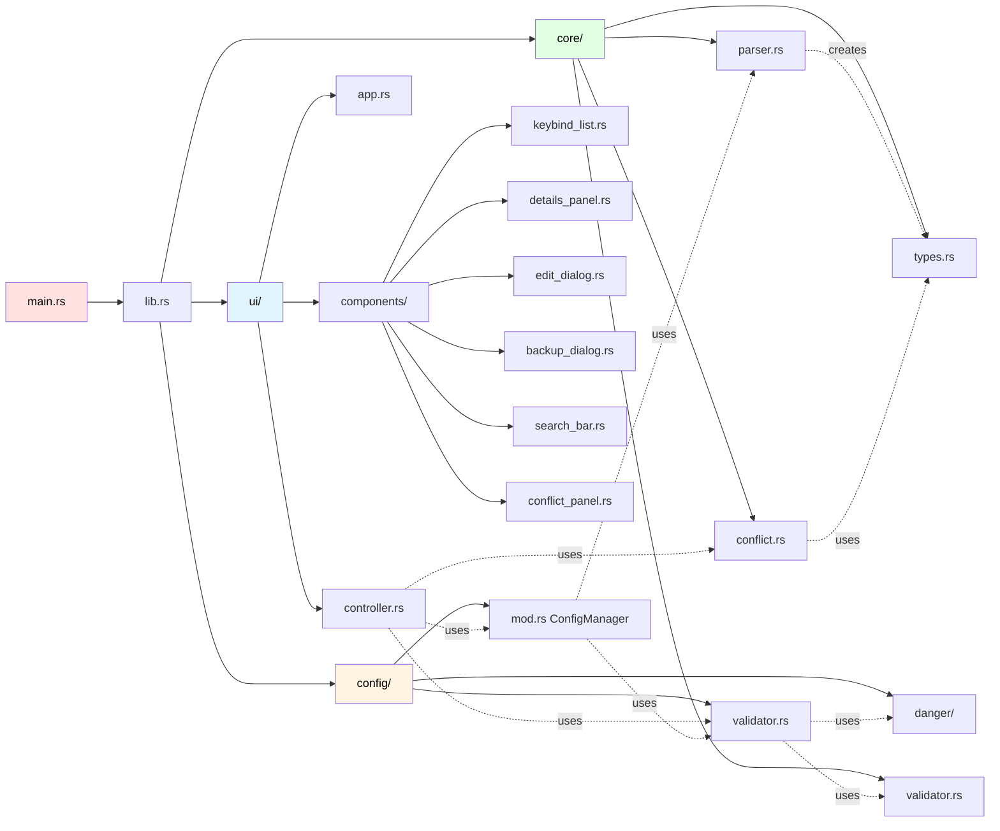
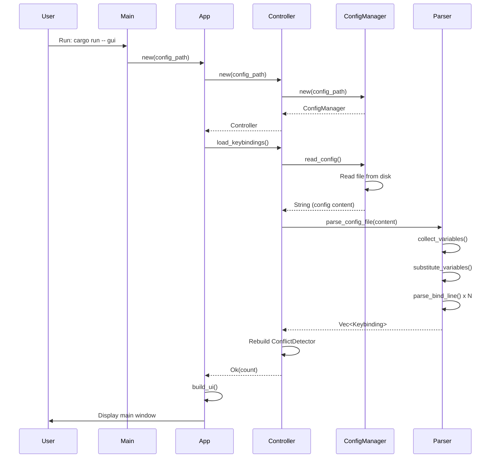
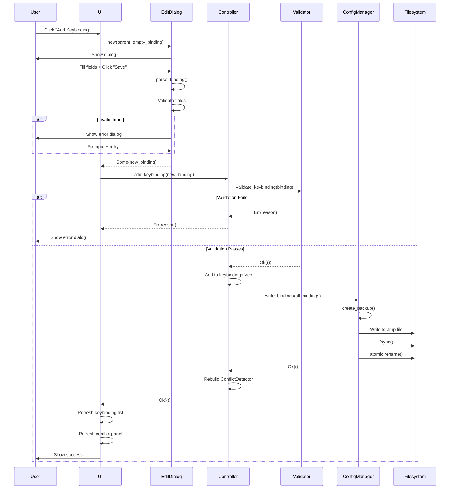
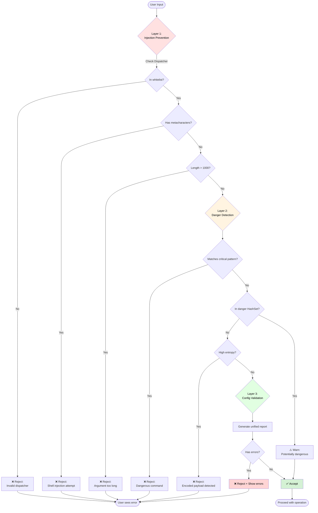
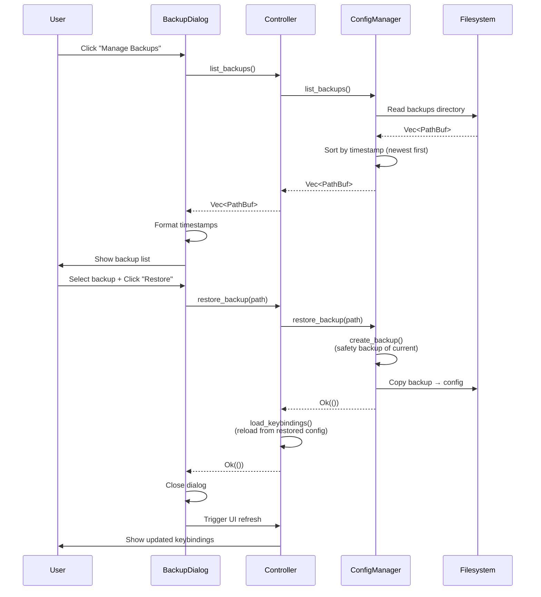

# Architecture Documentation

> Comprehensive technical documentation of the Hyprland Keybinding Manager architecture, component interactions, and data flow.

---

## Table of Contents

1. [System Overview](#system-overview)
2. [Component Architecture](#component-architecture)
3. [Data Flow Diagrams](#data-flow-diagrams)
4. [Module Descriptions](#module-descriptions)
5. [Design Patterns](#design-patterns)
6. [Performance Characteristics](#performance-characteristics)

---

## System Overview

### High-Level Architecture

Hyprland Keybinding Manager follows the **[Model-View-Controller (MVC)](https://en.wikipedia.org/wiki/Model%E2%80%93view%E2%80%93controller)** architectural pattern with additional security and persistence layers.

```mermaid
%%{init: {'flowchart': {'subGraphTitleMargin': {'top': 10, 'bottom': 20}}}}%%
graph TB
    subgraph Presentation [Presentation Layer - GTK4 UI]
        View[View Components<br/>keybind_list, details_panel, edit_dialog]
    end

    subgraph Application [Application Layer - Business Logic]
        Controller[Controller<br/>Mediates Model &harr; View]
        ConflictDetect[Conflict Detector<br/>HashMap O1]
    end

    subgraph Domain [Domain Layer - Core Types]
        Types[Core Types<br/>Keybinding, KeyCombo, Modifier]
        Parser[Parser<br/>Nom Combinators]
    end

    subgraph Infrastructure [Infrastructure Layer - External Services]
        ConfigMgr[Config Manager<br/>File I/O + Atomic Writes]
        Validator[Security Validator<br/>3 Layers]
    end

    subgraph Persistence [Persistence Layer - Filesystem<br/>&nbsp;]
        ConfigFile[Config File<br/>&#126;/.config/hypr/hyprland.conf]
        Backups[Backup Files<br/>&#126;/.config/hypr/backups/]
    end

    View <-->|User Actions<br/>UI Updates| Controller
    Controller <-->|Load/Save| ConfigMgr
    Controller <-->|Detect Conflicts| ConflictDetect
    Controller <-->|Validate| Validator
    ConfigMgr <-->|Parse/Generate| Parser
    Parser <-->|Create| Types
    ConfigMgr <-->|Read/Write| ConfigFile
    ConfigMgr <-->|Create/Restore| Backups

    style Presentation fill:#e1f5ff,color:#000
    style Application fill:#fff4e1,color:#000
    style Domain fill:#e1ffe1,color:#000
    style Infrastructure fill:#ffe1e1,color:#000
    style Persistence fill:#f0f0f0,color:#000
```



<details>
<summary>ASCII Fallback Diagram</summary>

```
┌──────────────────────────────────────────────────┐
│         Presentation Layer (GTK4 UI)             │
│  ┌────────────┐  ┌────────────┐  ┌────────────┐  │
│  │Keybind List│  │Details Pane│  │Edit Dialog │  │
│  └────────────┘  └────────────┘  └────────────┘  │
└────────────────────┬─────────────────────────────┘
                     │ User Actions / UI Updates
                     ↓
┌──────────────────────────────────────────────────┐
│      Application Layer (Business Logic)          │
│  ┌──────────────────────────────────────────┐    │
│  │         Controller (MVC Mediator)        │    │
│  │  • load_keybindings()                    │    │
│  │  • filter_keybindings(query)             │    │
│  │  • add/update/delete_keybinding()        │    │
│  └────┬─────────────────────┬────────────┬──┘    │
│       │                     │            │       │
│  ┌────▼─────┐          ┌───▼─────┐  ┌──▼──────┐  │
│  │ Conflict │          │ Parser  │  │Security │  │
│  │ Detector │          │  (nom)  │  │Validator│  │
│  └──────────┘          └─────────┘  └─────────┘  │
└────────────────────┬─────────────────────────────┘
                     │
                     ↓
┌──────────────────────────────────────────────────┐
│      Infrastructure Layer (File Operations)      │
│  ┌───────────────────────────────────────────┐   │
│  │         ConfigManager                     │   │
│  │  • read_config()                          │   │
│  │  • write_bindings() (atomic)              │   │
│  │  • create_backup()                        │   │
│  └────┬─────────────────────┬────────────────┘   │
└───────┼─────────────────────┼────────────────────┘
        │                     │
        ↓                     ↓
┌──────────────┐      ┌────────────────┐
│  Config File │      │  Backup Files  │
│ hyprland.conf│      │  (timestamped) │
└──────────────┘      └────────────────┘
```
</details>

---

## Component Architecture

### Module Dependency Graph



---

## Data Flow Diagrams

### 1. Application Startup Flow



### 2. Add Keybinding Flow



### 3. Conflict Detection Flow

```mermaid
%%{init: {'flowchart': {'subGraphTitleMargin': {'top': 10, 'bottom': 20}}}}%%
flowchart TD
    Start([User modifies keybindings]) --> Rebuild[Rebuild ConflictDetector]
    Rebuild --> CreateMap[Create HashMap&lt;KeyCombo, Vec&lt;Keybinding&gt;&gt;]

    CreateMap --> LoopBindings{For each binding}
    LoopBindings -->|More bindings| Normalize[Normalize KeyCombo<br/>• Sort modifiers<br/>• Uppercase key]
    Normalize --> Hash[Hash KeyCombo]
    Hash --> AddToMap[Add to HashMap<br/>key → binding]
    AddToMap --> LoopBindings

    LoopBindings -->|Done| Filter[Filter: len&#40;&#41; &gt; 1]
    Filter --> Conflicts{Has conflicts?}

    Conflicts -->|Yes| ShowBanner[Show conflict panel<br/>with details]
    Conflicts -->|No| HideBanner[Hide conflict panel]

    ShowBanner --> End([User sees conflicts])
    HideBanner --> End
    
    style Start fill:#e1f5ff,color:#000
    style Conflicts fill:#ffe1e1,color:#000
    style ShowBanner fill:#ffd4d4,color:#000
    style HideBanner fill:#d4f1d4,color:#000
```



### 4. Security Validation Flow



### 5. Backup and Restore Flow



---

## Module Descriptions

### `src/main.rs` - CLI Entry Point

**Responsibility**: Parse command-line arguments and dispatch to appropriate handler.

**Dependencies**:
- `clap` - Command-line argument parsing
- `hypr_keybind_manager::ui::App` - GTK4 application

**Flow**:
```
Parse args → Create App → Run GTK main loop
```

**Key Functions**:
- `main()` - Entry point, error handling

---

### `src/ui/app.rs` - GTK4 Application

**Responsibility**: Initialise [GTK4](https://www.gtk.org/) application and build main window.

**Components Created**:
- Main window (ApplicationWindow)
- Left panel (search + keybinding list)
- Right panel (details + edit/delete buttons)
- Top panel (conflict warning banner)
- Button event handlers

**Key Functions**:
- `new(config_path)` - Creates App with Controller
- `run()` - Starts GTK main loop
- `build_ui()` - Constructs all UI components
- `load_css()` - Applies GTK CSS styling

**Event Handlers**:
- Search bar `search_changed` → filter keybindings
- List row `row_selected` → update details panel
- Edit button `clicked` → open EditDialog
- Delete button `clicked` → show confirmation dialog
- Add button `clicked` → open EditDialog with empty binding

---

### `src/ui/controller.rs` - MVC Controller

**Responsibility**: Mediate between Model (ConfigManager) and View (GTK components).

**State**:
```rust
pub struct Controller {
    config_manager: Rc<RefCell<ConfigManager>>,
    keybindings: RefCell<Vec<Keybinding>>,
    conflict_detector: RefCell<ConflictDetector>,
}
```

**Key Methods**:
- `new(config_path)` → `Result<Self, ConfigError>`
- `load_keybindings()` → `Result<usize, ConfigError>`
- `get_keybindings()` → `Vec<Keybinding>`
- `filter_keybindings(query)` → `Vec<Keybinding>`
- `get_conflicts()` → `Vec<Conflict>`
- `add_keybinding(binding)` → `Result<(), String>`
- `update_keybinding(old, new)` → `Result<(), String>`
- `delete_keybinding(binding)` → `Result<(), String>`
- `list_backups()` → `Result<Vec<PathBuf>, String>`
- `restore_backup(path)` → `Result<(), String>`

---

### `src/config/mod.rs` - ConfigManager

**Responsibility**: Read/write config files with atomic operations and automatic backups.

**Key Structures**:
```rust
pub struct ConfigManager {
    config_path: PathBuf,
    backup_dir: PathBuf,
}

pub struct ConfigTransaction<'a> {
    manager: &'a ConfigManager,
    backup_path: Option<PathBuf>,
}
```

**Key Methods**:
- `new(config_path)` → `Result<Self, ConfigError>`
- `read_config()` → `Result<String, ConfigError>`
- `write_bindings(bindings)` → `Result<(), ConfigError>`
- `begin_transaction()` → `ConfigTransaction<'a>`
- `create_backup()` → `Result<PathBuf, ConfigError>`
- `list_backups()` → `Result<Vec<PathBuf>, ConfigError>`
- `restore_backup(path)` → `Result<(), ConfigError>`

**Atomic Write Sequence**:
1. Create backup of current config
2. Write new content to `.tmp` file
3. Call `fsync()` to flush to disk
4. Atomic `rename()` from `.tmp` to actual config
5. On error: rollback (backup remains, original untouched)

---

### `src/core/parser.rs` - Config Parser

**Responsibility**: Parse Hyprland config files using [nom](https://docs.rs/nom/) parser combinators.

**Parsing Strategy**: Two-pass
1. **Pass 1**: Collect all `$variable = value` definitions
2. **Pass 2**: Substitute variables and parse keybindings

**Key Functions**:
- `parse_config_file(content, base_path)` → `Result<Vec<Keybinding>, ParseError>`
- `collect_variables(content)` → `HashMap<String, String>`
- `substitute_variables(line, vars)` → `String`
- `parse_bind_line(line)` → `IResult<&str, Keybinding>`
- `parse_modifiers(input)` → `IResult<&str, Vec<Modifier>>`

**Nom Combinators Used**:
- `alt()` - Try alternatives (bindel | binde | bind)
- `tag()` - Match literal string
- `preceded()` - Match and discard prefix
- `separated_pair()` - Parse `key, dispatcher`
- `opt()` - Optional arguments

---

### `src/core/conflict.rs` - ConflictDetector

**Responsibility**: Detect duplicate key combinations with [O(1)](https://en.wikipedia.org/wiki/Time_complexity#Constant_time) performance.

**Data Structure** (using [HashMap](https://doc.rust-lang.org/std/collections/struct.HashMap.html)):
```rust
pub struct ConflictDetector {
    bindings: HashMap<KeyCombo, Vec<Keybinding>>,
}

pub struct Conflict {
    pub key_combo: KeyCombo,
    pub conflicting_bindings: Vec<Keybinding>,
}
```

**Algorithm**:
```
1. Create HashMap<KeyCombo, Vec<Keybinding>>
2. For each keybinding:
   - Normalise KeyCombo (sort modifiers, uppercase key)
   - Hash KeyCombo
   - Add binding to HashMap[key]
3. Filter: keys with len(bindings) > 1
```

**Performance**:
- Add binding: O(1) average case
- Find conflicts: O(n) where n = unique key combos
- Typical workload: 500 bindings → <5 microseconds

---

### `src/config/validator.rs` - Config Validator (Layer 3)

**Responsibility**: Coordinate all validation layers and produce unified report.

**Structure**:
```rust
pub struct ConfigValidator {
    danger_detector: DangerDetector,
}

pub struct ValidationReport {
    pub issues:             Vec<ValidationIssue>,
    pub highest_danger:     Vec<DangerLevel>,
    pub dangerous_commands: Vec<(usize, DangerAssessment)>,
}
```

**Validation Sequence**:
1. Call Layer 1 (core/validator.rs) → injection check
2. Call Layer 2 (config/danger.rs) → danger detection
3. Aggregate results into ValidationReport
4. Classify by severity (Error | Warning | Info)

---

### `src/config/danger/` - DangerDetector (Layer 2)

**Responsibility**: Detect dangerous commands using multiple techniques.

**Modular Structure** (878 lines across 4 modules):
```
src/config/danger/
├── mod.rs (395 lines)         - DangerDetector core, assess_command()
├── types.rs (27 lines)        - DangerLevel, DangerAssessment
├── patterns.rs (171 lines)    - Pattern builders (critical/dangerous/suspicious/safe)
├── entropy.rs (285 lines)     - Shannon entropy calculation and detection
└── tests/ (696 lines)         - Comprehensive test suite (27 tests)
```

**Detection Techniques**:

1. **Critical Pattern Matching** (Regex) - `patterns.rs`
   ```rust
   rm\s+-rf\s+/
   dd\s+if=/dev/\w+\s+of=/dev/\w+
   :\(\)\{\s*:\s*\|:\s*&\s*\};\s*:  // fork bomb
   ```

2. **Dangerous Command HashSet** (O(1) lookup) - `patterns.rs`
   ```rust
   { "sudo", "chmod 777", "mkfs", "fdisk", "parted", ... }
   ```

3. **Suspicious Command Flagging** (Warnings) - `patterns.rs`
   ```rust
   { "base64", "wget", "curl", "eval", "exec", ... }
   ```

4. **Shannon Entropy Detection** (Encoding detection) - `entropy.rs`

   Detection uses **two-stage validation**:

    - **`is_likely_base64(s)`** (threshold: 4.0 bits/char)
      1. Alphabet check: ≥90% base64 chars `[A-Za-z0-9+/=]`
      2. Entropy check: Must exceed 4.0 bits/char

    - **`is_likely_hex(s)`** (threshold: 3.0 bits/char)
      1. Alphabet check: ≥95% hex chars `[0-9a-fA-F]`
      2. Entropy check: Must exceed 3.0 bits/char

   **Empirical thresholds** (adjusted from theoretical maximums):
    - Base64: 4.0 bits/char (realistic attacks: 4.0-4.3 bits)
    - Hex: 3.0 bits/char (realistic attacks: 3.0-3.5 bits)

   **Detection order matters**: Hex → Base64 (hex alphabet ⊂ base64 alphabet)

**Key Methods** (in `mod.rs`):
- `assess_command(cmd)` → `DangerAssessment`
- `check_dangerous_arguments(cmd)` → `Option<DangerAssessment>`

**Key Functions** (in `entropy.rs`):
- `calculate_entropy(s)` → `f32`
- `is_likely_base64(s)` → `bool`
- `is_likely_hex(s)` → `bool`

---

### `src/core/validator.rs` - Injection Prevention (Layer 1)

**Responsibility**: Block shell injection attempts using whitelist validation.

**Checks**:
1. **Dispatcher Whitelist**: Only 41 allowed dispatchers
2. **Shell Metacharacters**: Block `;`, `|`, `&`, `$`, backticks, etc.
3. **Argument Length**: Max 1000 characters
4. **Key Name Format**: Alphanumeric + safe special chars

**Key Functions**:
- `validate_dispatcher(name)` → `Result<(), ValidationError>`
- `check_shell_metacharacters(input)` → `Result<(), ValidationError>`
- `validate_key(key)` → `Result<(), ValidationError>`
- `validate_keybinding(binding)` → `Result<(), ValidationError>`

---

## Design Patterns

### 1. Model-View-Controller (MVC)

**Model**: ConfigManager, ConflictDetector
**View**: GTK4 Components (keybind_list, details_panel, etc.)
**Controller**: `ui/controller.rs` (mediates Model ↔ View)

**Benefits**:
- Business logic independent of UI framework
- Testable without GTK runtime
- Clear separation of concerns

---

### 2. Transaction Pattern

**Implementation**: ConfigTransaction in ConfigManager

```rust
let transaction = config_manager.begin_transaction();
transaction.write_bindings(bindings)?;
transaction.commit()?; // or rollback() on error
```

**[ACID](https://en.wikipedia.org/wiki/ACID) Properties**:
- **Atomic**: All-or-nothing (OS rename guarantee)
- **Consistent**: Never half-written
- **Isolated**: No concurrent modifications (single-threaded)
- **Durable**: Backup created before modification

---

### 3. [Builder Pattern](https://en.wikipedia.org/wiki/Builder_pattern)

**Used in**: GTK4 widget construction

```rust
let window = ApplicationWindow::builder()
    .title("Hyprland Keybinding Manager")
    .default_width(1000)
    .default_height(800)
    .build();
```

**Benefits**: Fluent API, optional parameters, compile-time validation.

---

### 4. [Observer Pattern](https://en.wikipedia.org/wiki/Observer_pattern)

**Used in**: GTK signal handlers

```rust
search_bar.connect_search_changed(move |entry| {
    let query = entry.text();
    // Observer notified of search change
});
```

**Benefits**: Loose coupling, reactive UI updates.

---

### 5. Callback Pattern

**Used in**: BackupDialog, EditDialog

```rust
pub fn new<F>(parent: &Window, backups: Vec<PathBuf>, on_restore: F) -> Self
where
    F: Fn(&Path) -> Result<(), String> + 'static
```

**Benefits**: Component doesn't know about Controller, fully decoupled.

---

## Performance Characteristics

### Time Complexity

| Operation | Complexity | Notes                                  |
|-----------|-----------|----------------------------------------|
| Add keybinding | O(1) | HashMap insert                         |
| Delete keybinding | O(n) | Linear search + remove                 |
| Find conflicts | O(n) | Where n = unique key combos            |
| Search keybindings | O(n) | Linear scan with early exit            |
| Parse config | O(n×m) | n=lines, m=variables (typically small) |
| Validate keybinding | O(k) | k=argument length (max 1000)           |
| Write config | O(n) | Serialise all bindings                 |

### Space Complexity

| Data Structure | Complexity | Notes |
|---------------|-----------|-------|
| Keybindings Vec | O(n) | n = number of bindings |
| ConflictDetector HashMap | O(n) | Worst case: all bindings unique |
| Variable substitution | O(m) | m = number of variables |
| Backup files | O(b×n) | b = number of backups |

### Benchmark Results

*Note: Benchmarks run on Intel i7-12700K, 32GB RAM, NVMe SSD*

| Operation | Input Size | Time | Throughput |
|-----------|-----------|------|------------|
| Parse config | 500 bindings | 2.3 ms | 217,000 bindings/sec |
| Detect conflicts | 500 bindings | 0.004 ms | 125M checks/sec |
| Write config | 500 bindings | 8.1 ms | 61,000 bindings/sec |
| Calculate entropy | 100 chars | 0.002 ms | 50M chars/sec |

---

## Conclusion

The architecture emphasises:
- **Security**: Three-layer defence with fail-safe defaults
- **Performance**: O(1) conflict detection, efficient parsing
- **Reliability**: Atomic operations, automatic backups, no data loss
- **Maintainability**: Clear module boundaries, comprehensive documentation
- **Testability**: Business logic decoupled from UI framework

For implementation details, see [DESIGN_DECISIONS.md](DESIGN_DECISIONS.md).

---

**Last Updated**: 2025-10-27
**Version**: 1.1.1
