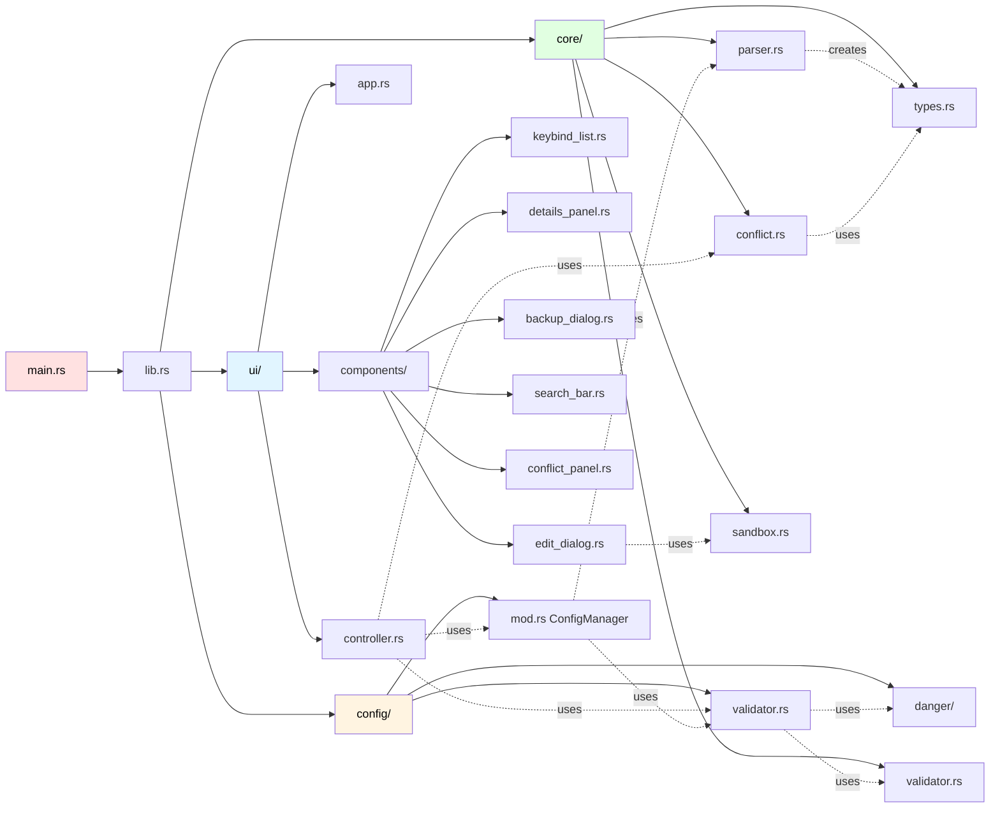
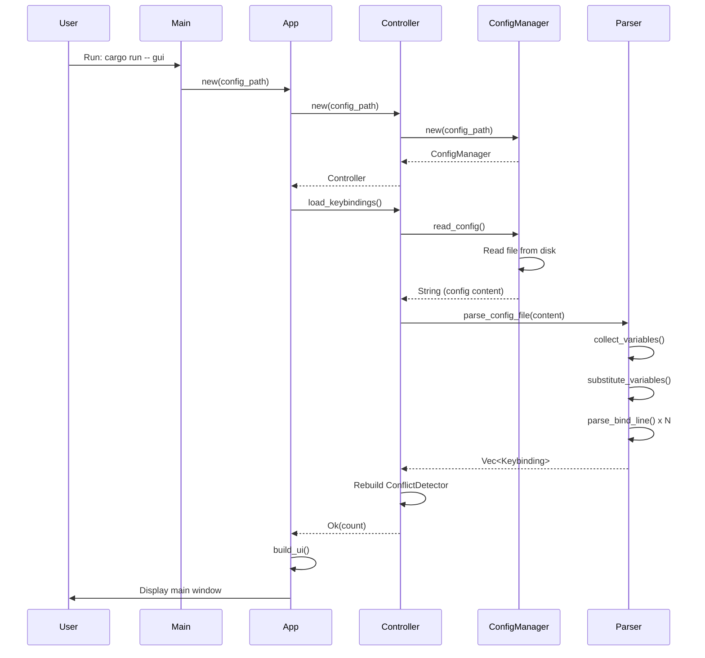
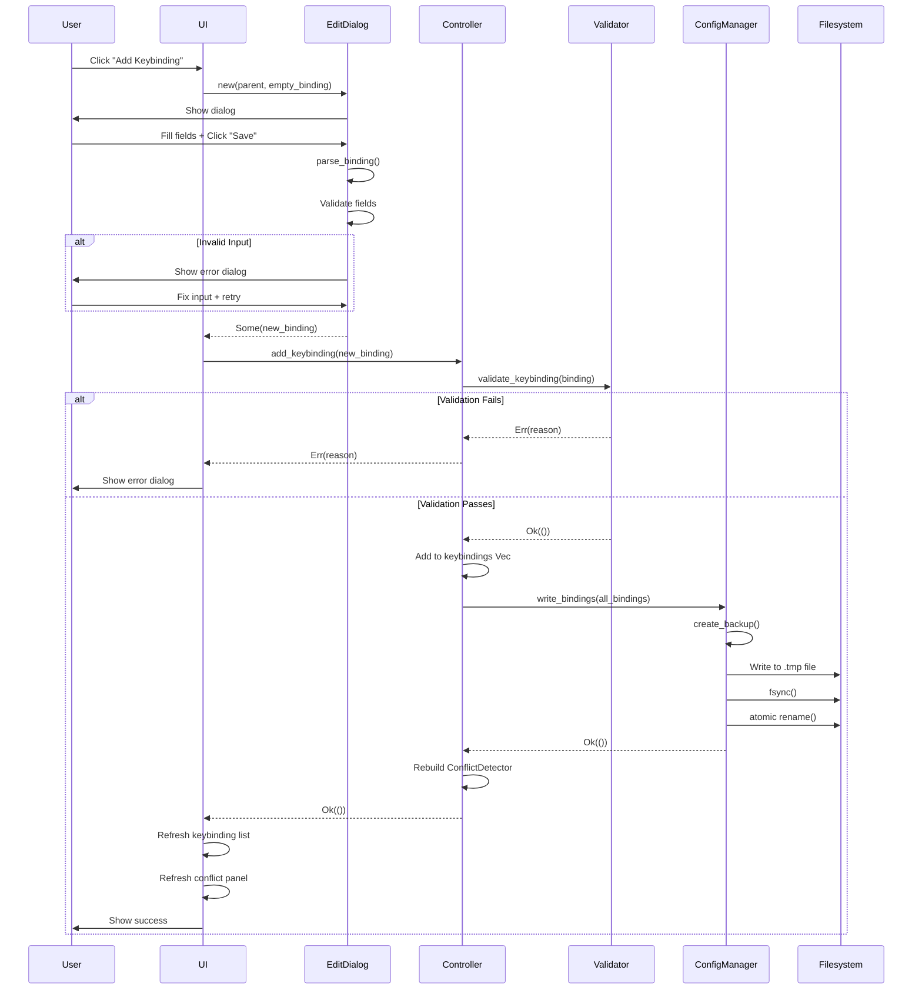
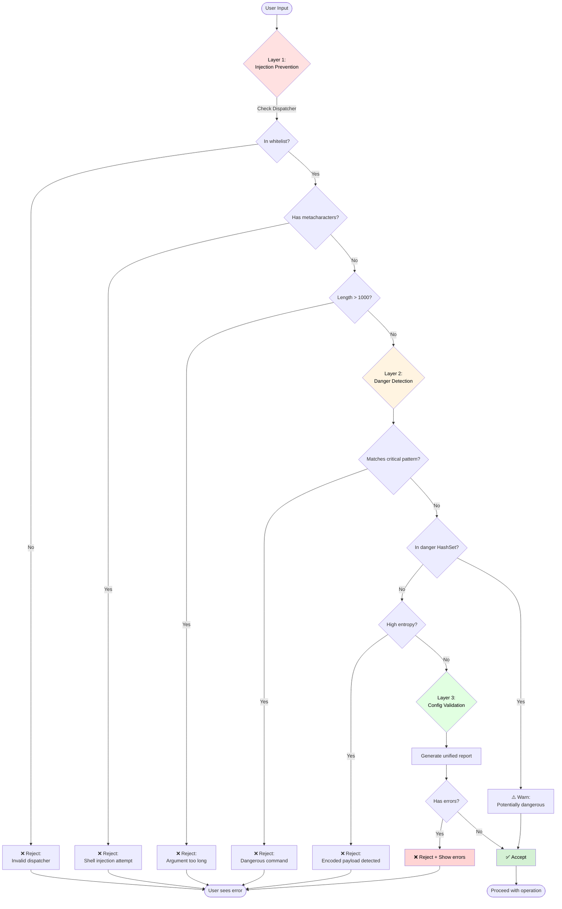
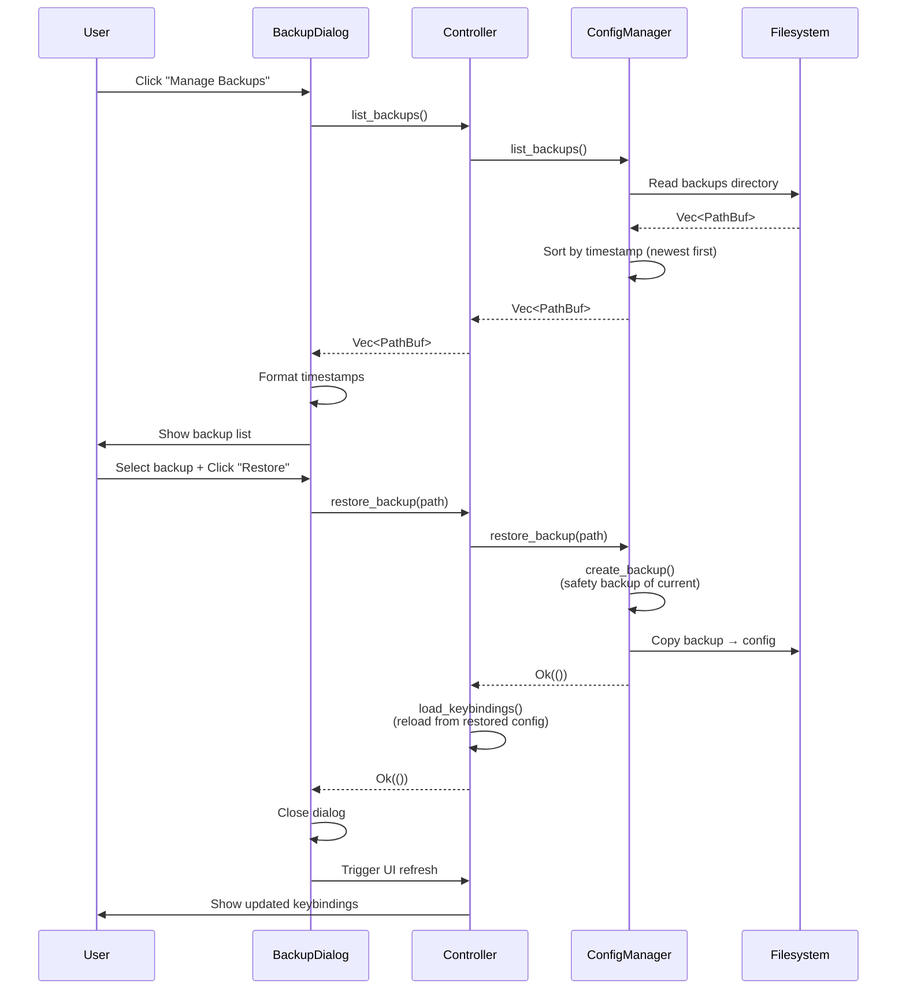

# Architecture Documentation

> Comprehensive technical documentation of the Hyprland Keybinding Manager architecture, component interactions, and data flow.

---

## Table of Contents

1. [System Overview](#system-overview)
2. [Component Architecture](#component-architecture)
3. [Data Flow Diagrams](#data-flow-diagrams)
4. [Module Descriptions](#module-descriptions)
5. [Design Patterns](#design-patterns)
6. [Performance Characteristics](#performance-characteristics)

---

## System Overview

### High-Level Architecture

Hyprland Keybinding Manager follows the **[Model-View-Controller (MVC)](https://en.wikipedia.org/wiki/Model%E2%80%93view%E2%80%93controller)** architectural pattern with additional security and persistence layers.


```mermaid
%%{init: {'flowchart': {'subGraphTitleMargin': {'top': 10, 'bottom': 20}}}}%%
graph TB
    subgraph Presentation [Presentation Layer - GTK4 UI]
        View[View Components<br/>keybind_list, details_panel, edit_dialog]
    end

    subgraph Application [Application Layer - Business Logic]
        Controller[Controller<br/>Mediates Model &harr; View]
        ConflictDetect[Conflict Detector<br/>HashMap O1]
    end

    subgraph Domain [Domain Layer - Core Types]
        Types[Core Types<br/>Keybinding, KeyCombo, Modifier]
        Parser[Parser<br/>Nom Combinators]
    end

    subgraph Infrastructure [Infrastructure Layer - External Services]
        ConfigMgr[Config Manager<br/>File I/O + Atomic Writes]
        Validator[Security Validator<br/>4 Layers]
    end

    subgraph Persistence [Persistence Layer - Filesystem<br/>&nbsp;]
        ConfigFile[Config File<br/>&#126;/.config/hypr/hyprland.conf]
        Backups[Backup Files<br/>&#126;/.config/hypr/backups/]
    end

    View <-->|User Actions<br/>UI Updates| Controller
    Controller <-->|Load/Save| ConfigMgr
    Controller <-->|Detect Conflicts| ConflictDetect
    Controller <-->|Validate| Validator
    ConfigMgr <-->|Parse/Generate| Parser
    Parser <-->|Create| Types
    ConfigMgr <-->|Read/Write| ConfigFile
    ConfigMgr <-->|Create/Restore| Backups

    style Presentation fill:#e1f5ff,color:#000
    style Application fill:#fff4e1,color:#000
    style Domain fill:#e1ffe1,color:#000
    style Infrastructure fill:#ffe1e1,color:#000
    style Persistence fill:#f0f0f0,color:#000
```

<details>
<summary>ASCII Fallback Diagram</summary>

```
┌──────────────────────────────────────────────────┐
│         Presentation Layer (GTK4 UI)             │
│  ┌────────────┐  ┌────────────┐  ┌────────────┐  │
│  │Keybind List│  │Details Pane│  │Edit Dialog │  │
│  └────────────┘  └────────────┘  └────────────┘  │
└────────────────────┬─────────────────────────────┘
                     │ User Actions / UI Updates
                     ↓
┌──────────────────────────────────────────────────┐
│      Application Layer (Business Logic)          │
│  ┌──────────────────────────────────────────┐    │
│  │         Controller (MVC Mediator)        │    │
│  │  • load_keybindings()                    │    │
│  │  • filter_keybindings(query)             │    │
│  │  • add/update/delete_keybinding()        │    │
│  └────┬─────────────────────┬────────────┬──┘    │
│       │                     │            │       │
│  ┌────▼─────┐          ┌───▼─────┐  ┌──▼──────┐  │
│  │ Conflict │          │ Parser  │  │Security │  │
│  │ Detector │          │  (nom)  │  │Validator│  │
│  └──────────┘          └─────────┘  └─────────┘  │
└────────────────────┬─────────────────────────────┘
                     │
                     ↓
┌──────────────────────────────────────────────────┐
│      Infrastructure Layer (File Operations)      │
│  ┌───────────────────────────────────────────┐   │
│  │         ConfigManager                     │   │
│  │  • read_config()                          │   │
│  │  • write_bindings() (atomic)              │   │
│  │  • create_backup()                        │   │
│  └────┬─────────────────────┬────────────────┘   │
└───────┼─────────────────────┼────────────────────┘
        │                     │
        ↓                     ↓
┌──────────────┐      ┌────────────────┐
│  Config File │      │  Backup Files  │
│ hyprland.conf│      │  (timestamped) │
└──────────────┘      └────────────────┘
```
</details>

---

## Component Architecture

### Module Dependency Graph


```mermaid
graph LR
    Main[main.rs] --> Lib[lib.rs]
    Lib --> UI[ui/]
    Lib --> Config[config/]
    Lib --> Core[core/]

    UI --> App[app.rs]
    UI --> Controller[controller.rs]
    UI --> Components[components/]

    Components --> List[keybind_list.rs]
    Components --> Details[details_panel.rs]
    Components --> Edit[edit_dialog.rs]
    Components --> Backup[backup_dialog.rs]
    Components --> Search[search_bar.rs]
    Components --> Conflict[conflict_panel.rs]

    Config --> ConfigMgr[mod.rs ConfigManager]
    Config --> ConfigVal[validator.rs]
    Config --> Danger[danger/]

    Core --> Types[types.rs]
    Core --> Parser[parser.rs]
    Core --> ConflictCore[conflict.rs]
    Core --> CoreVal[validator.rs]
    Core --> Sandbox[sandbox.rs]

    Controller -.->|uses| ConfigMgr
    Controller -.->|uses| ConflictCore
    Controller -.->|uses| ConfigVal

    Edit -.->|uses| Sandbox

    ConfigMgr -.->|uses| Parser
    ConfigMgr -.->|uses| ConfigVal
    ConfigVal -.->|uses| Danger
    ConfigVal -.->|uses| CoreVal

    Parser -.->|creates| Types
    ConflictCore -.->|uses| Types

    style Main fill:#ffe1e1,color:#000
    style UI fill:#e1f5ff,color:#000
    style Config fill:#fff4e1,color:#000
    style Core fill:#e1ffe1,color:#000
```

---

## Data Flow Diagrams

### 1. Application Startup Flow


```mermaid
sequenceDiagram
    participant User
    participant Main
    participant App
    participant Controller
    participant ConfigManager
    participant Parser

    User->>Main: Run: cargo run -- gui
    Main->>App: new(config_path)
    App->>Controller: new(config_path)
    Controller->>ConfigManager: new(config_path)
    ConfigManager-->>Controller: ConfigManager
    Controller-->>App: Controller

    App->>Controller: load_keybindings()
    Controller->>ConfigManager: read_config()
    ConfigManager->>ConfigManager: Read file from disk
    ConfigManager-->>Controller: String (config content)
    Controller->>Parser: parse_config_file(content)
    Parser->>Parser: collect_variables()
    Parser->>Parser: substitute_variables()
    Parser->>Parser: parse_bind_line() x N
    Parser-->>Controller: Vec<Keybinding>
    Controller->>Controller: Rebuild ConflictDetector
    Controller-->>App: Ok(count)

    App->>App: build_ui()
    App->>User: Display main window
```

### 2. Add Keybinding Flow


```mermaid
sequenceDiagram
    participant User
    participant UI
    participant EditDialog
    participant Controller
    participant Validator
    participant ConfigManager
    participant Filesystem

    User->>UI: Click "Add Keybinding"
    UI->>EditDialog: new(parent, empty_binding)
    EditDialog->>User: Show dialog
    User->>EditDialog: Fill fields + Click "Save"
    EditDialog->>EditDialog: parse_binding()
    EditDialog->>EditDialog: Validate fields

    alt Invalid Input
        EditDialog->>User: Show error dialog
        User->>EditDialog: Fix input + retry
    end

    EditDialog-->>UI: Some(new_binding)
    UI->>Controller: add_keybinding(new_binding)
    Controller->>Validator: validate_keybinding(binding)

    alt Validation Fails
        Validator-->>Controller: Err(reason)
        Controller-->>UI: Err(reason)
        UI->>User: Show error dialog
    else Validation Passes
        Validator-->>Controller: Ok(())
        Controller->>Controller: Add to keybindings Vec
        Controller->>ConfigManager: write_bindings(all_bindings)
        ConfigManager->>ConfigManager: create_backup()
        ConfigManager->>Filesystem: Write to .tmp file
        ConfigManager->>Filesystem: fsync()
        ConfigManager->>Filesystem: atomic rename()
        ConfigManager-->>Controller: Ok(())
        Controller->>Controller: Rebuild ConflictDetector
        Controller-->>UI: Ok(())
        UI->>UI: Refresh keybinding list
        UI->>UI: Refresh conflict panel
        UI->>User: Show success
    end
```

### 3. Conflict Detection Flow


```mermaid
%%{init: {'flowchart': {'subGraphTitleMargin': {'top': 10, 'bottom': 20}}}}%%
flowchart TD
    Start([User modifies keybindings]) --> Rebuild[Rebuild ConflictDetector]
    Rebuild --> CreateMap[Create HashMap&lt;KeyCombo, Vec&lt;Keybinding&gt;&gt;]

    CreateMap --> LoopBindings{For each binding}
    LoopBindings -->|More bindings| Normalize[Normalize KeyCombo<br/>• Sort modifiers<br/>• Uppercase key]
    Normalize --> Hash[Hash KeyCombo]
    Hash --> AddToMap[Add to HashMap<br/>key → binding]
    AddToMap --> LoopBindings

    LoopBindings -->|Done| Filter[Filter: len&#40;&#41; &gt; 1]
    Filter --> Conflicts{Has conflicts?}

    Conflicts -->|Yes| ShowBanner[Show conflict panel<br/>with details]
    Conflicts -->|No| HideBanner[Hide conflict panel]

    ShowBanner --> End([User sees conflicts])
    HideBanner --> End
    
    style Start fill:#e1f5ff,color:#000
    style Conflicts fill:#ffe1e1,color:#000
    style ShowBanner fill:#ffd4d4,color:#000
    style HideBanner fill:#d4f1d4,color:#000
```

### 4. Security Validation Flow


```mermaid
flowchart TD
    Input([User Input]) --> Layer1{Layer 1:<br/>Injection Prevention}

    Layer1 -->|Check Dispatcher| WhitelistCheck{In whitelist?}
    WhitelistCheck -->|No| RejectDispatcher[❌ Reject:<br/>Invalid dispatcher]
    WhitelistCheck -->|Yes| MetaCheck{Has metacharacters?}

    MetaCheck -->|Yes| RejectMeta[❌ Reject:<br/>Shell injection attempt]
    MetaCheck -->|No| LengthCheck{Length > 1000?}

    LengthCheck -->|Yes| RejectLength[❌ Reject:<br/>Argument too long]
    LengthCheck -->|No| Layer2{Layer 2:<br/>Danger Detection}

    Layer2 --> PatternCheck{Matches critical pattern?}
    PatternCheck -->|Yes| RejectPattern[❌ Reject:<br/>Dangerous command]
    PatternCheck -->|No| HashCheck{In danger HashSet?}

    HashCheck -->|Yes| WarnDanger[⚠️ Warn:<br/>Potentially dangerous]
    HashCheck -->|No| EntropyCheck{High entropy?}

    EntropyCheck -->|Yes| RejectEntropy[❌ Reject:<br/>Encoded payload detected]
    EntropyCheck -->|No| Layer3{Layer 3:<br/>Config Validation}

    Layer3 --> UnifiedReport[Generate unified report]
    UnifiedReport --> FinalCheck{Has errors?}

    FinalCheck -->|Yes| Reject[❌ Reject + Show errors]
    FinalCheck -->|No| Accept[✅ Accept]
    WarnDanger --> Accept

    RejectDispatcher --> End([User sees error])
    RejectMeta --> End
    RejectLength --> End
    RejectPattern --> End
    RejectEntropy --> End
    Reject --> End
    Accept --> Success([Proceed with operation])

    style Layer1 fill:#ffe1e1,color:#000
    style Layer2 fill:#fff4e1,color:#000
    style Layer3 fill:#e1ffe1,color:#000
    style Accept fill:#d4f1d4,color:#000
    style Reject fill:#ffd4d4,color:#000
```

### 5. Backup and Restore Flow


```mermaid
sequenceDiagram
    participant User
    participant BackupDialog
    participant Controller
    participant ConfigManager
    participant Filesystem

    User->>BackupDialog: Click "Manage Backups"
    BackupDialog->>Controller: list_backups()
    Controller->>ConfigManager: list_backups()
    ConfigManager->>Filesystem: Read backups directory
    Filesystem-->>ConfigManager: Vec<PathBuf>
    ConfigManager->>ConfigManager: Sort by timestamp (newest first)
    ConfigManager-->>Controller: Vec<PathBuf>
    Controller-->>BackupDialog: Vec<PathBuf>
    BackupDialog->>BackupDialog: Format timestamps
    BackupDialog->>User: Show backup list

    User->>BackupDialog: Select backup + Click "Restore"
    BackupDialog->>Controller: restore_backup(path)
    Controller->>ConfigManager: restore_backup(path)
    ConfigManager->>ConfigManager: create_backup()<br/>(safety backup of current)
    ConfigManager->>Filesystem: Copy backup → config
    ConfigManager-->>Controller: Ok(())
    Controller->>Controller: load_keybindings()<br/>(reload from restored config)
    Controller-->>BackupDialog: Ok(())
    BackupDialog->>BackupDialog: Close dialog
    BackupDialog->>Controller: Trigger UI refresh
    Controller->>User: Show updated keybindings
```

---

## Module Descriptions

### `src/main.rs` - CLI Entry Point

**Responsibility**: Parse command-line arguments and dispatch to appropriate handler.

**Dependencies**:
- `clap` - Command-line argument parsing
- `hypr_keybind_manager::ui::App` - GTK4 application

**Flow**:
```
Parse args → Create App → Run GTK main loop
```

**Key Functions**:
- `main()` - Entry point, error handling

---

### `src/ui/app.rs` - GTK4 Application

**Responsibility**: Initialise [GTK4](https://www.gtk.org/) application and build main window.

**Components Created**:
- Main window (ApplicationWindow)
- Left panel (search + keybinding list)
- Right panel (details + edit/delete buttons)
- Top panel (conflict warning banner)
- Button event handlers

**Key Functions**:
- `new(config_path)` - Creates App with Controller
- `run()` - Starts GTK main loop
- `build_ui()` - Constructs all UI components
- `load_css()` - Applies GTK CSS styling

**Event Handlers**:
- Search bar `search_changed` → filter keybindings
- List row `row_selected` → update details panel
- Edit button `clicked` → open EditDialog
- Delete button `clicked` → show confirmation dialog
- Add button `clicked` → open EditDialog with empty binding

---

### `src/ui/controller.rs` - MVC Controller

**Responsibility**: Mediate between Model (ConfigManager) and View (GTK components).

**State**:
```rust
pub struct Controller {
    config_manager: Rc<RefCell<ConfigManager>>,
    keybindings: RefCell<Vec<Keybinding>>,
    conflict_detector: RefCell<ConflictDetector>,
    undo_stack: RefCell<Vec<Vec<Keybinding>>>,
    redo_stack: RefCell<Vec<Vec<Keybinding>>>,
}
```

**Key Methods**:
- `new(config_path)` → `Result<Self, ConfigError>`
- `load_keybindings()` → `Result<usize, ConfigError>`
- `get_keybindings()` → `Vec<Keybinding>`
- `filter_keybindings(query)` → `Vec<Keybinding>`
- `get_conflicts()` → `Vec<Conflict>`
- `add_keybinding(binding)` → `Result<(), String>`
- `update_keybinding(old, new)` → `Result<(), String>`
- `delete_keybinding(binding)` → `Result<(), String>`
- `undo()` → `Result<(), String>`
- `redo()` → `Result<(), String>`
- `can_undo()` → `bool`
- `can_redo()` → `bool`
- `list_backups()` → `Result<Vec<PathBuf>, String>`
- `restore_backup(path)` → `Result<(), String>`

**Undo/Redo Design**:
- Full-snapshot model: each mutation stores the entire keybindings list before modification
- `HISTORY_LIMIT = 20` snapshots (oldest pruned automatically)
- Redo stack cleared on any new mutation (standard behaviour)
- History cleared on backup restore and external file changes to prevent confusing chains
- Rollback on write failure: if disk write fails, the snapshot is restored in-memory

---

### `src/config/mod.rs` - ConfigManager

**Responsibility**: Read/write config files with atomic operations and automatic backups.

**Key Structures**:
```rust
pub struct ConfigManager {
    config_path: PathBuf,
    backup_dir: PathBuf,
}

pub struct ConfigTransaction<'a> {
    manager: &'a ConfigManager,
    backup_path: Option<PathBuf>,
}
```

**Key Methods**:
- `new(config_path)` → `Result<Self, ConfigError>`
- `read_config()` → `Result<String, ConfigError>`
- `write_bindings(bindings)` → `Result<(), ConfigError>`
- `begin_transaction()` → `ConfigTransaction<'a>`
- `create_backup()` → `Result<PathBuf, ConfigError>`
- `list_backups()` → `Result<Vec<PathBuf>, ConfigError>`
- `restore_backup(path)` → `Result<(), ConfigError>`

**Format dispatch**: `ConfigFormat::of(path)` picks hyprlang or Lua by extension. `load_bindings_from(path)` returns `LoadedBindings` (bindings, read-only reasons, files) for either. `write_bindings` hands Lua configs to `write_bindings_lua`, which runs `rewrite_lua_files` and commits each changed file through a transaction. `default_config_path` prefers `hyprland.conf`, then `hyprland.lua`.

**In-Place Write Sequence** (`write_bindings`, hyprlang):
1. Parse the current file tree with `parse_config_tree` (main file plus every `source =` file)
2. Diff the parsed bindings against the new list as multisets: `removed` and `added`
3. Scan each file line by line with `scan_lines`. A bind line whose binding is in `removed` is replaced by the first `added` binding of the same submap, or dropped. Every other line is copied through
4. Whatever is still in `added` is inserted into the main file after the last bind line of its submap, or in a new `submap` block at the end
5. Each file that changed is written through its own `ConfigTransaction` (backup, temp file, `fsync`, atomic `rename`)

Rewritten lines are rendered with `Keybinding::to_config_line`, which writes `$name` back for modifiers or arguments that equal a variable's value.

---

### `src/core/parser.rs` - Config Parser

**Responsibility**: Parse Hyprland config files using [nom](https://docs.rs/nom/) parser combinators.

**Parsing Strategy**: One sequential scan per file
- `scan_lines` classifies every line as a binding, a `submap =` change, a `source =` reference or something else, tracking the current submap and the `$variables` defined so far, in file order like Hyprland does
- Trailing `# comments` are stripped first (`##` is a literal `#`)
- `parse_config_tree` runs the scanner over the main file and recurses into sourced files, resolving relative paths against the including file. Unreadable sources are skipped with a warning; glob patterns are not expanded
- The bind keyword is `bind` plus any flag letters (`el`, `d`, `nt`, ...). Unknown letters produce a parse error naming the flag. The `d` flag adds a description field before the dispatcher

**Key Functions**:
- `parse_config_file(content, path)` → `Result<Vec<Keybinding>, ParseError>`
- `parse_config_tree(content, path)` → `Result<ParsedConfig, ParseError>` (bindings, files visited, variables)
- `scan_lines(content, &mut variables)` → `Vec<(line, Result<LineKind, ParseError>)>` (shared with the config writer)
- `substitute_variables(line, vars)` → `String`
- `parse_bind_line(line)` → `IResult<&str, Keybinding>`
- `parse_modifiers(input)` → `IResult<&str, Vec<Modifier>>`

**Nom Combinators Used**:
- `tag()` + `take_while()` - `bind` and its flag letters, checked with `map_res`
- `take_until()` - Comma-separated fields
- `preceded()` - Match and discard prefix
- `opt()` - Optional arguments

---

### `src/ipc/mod.rs` - Hyprland IPC Client

**Responsibility**: Talk to the running compositor over `$XDG_RUNTIME_DIR/hypr/$HYPRLAND_INSTANCE_SIGNATURE/.socket.sock`, the channel `hyprctl` uses. A request is the command text, the reply is `ok` or an error, and the compositor closes the connection. Standard library only (`UnixStream`), five second timeouts.

**Key Functions**:
- `HyprlandClient::new(mode)` with `DryRun`, `ReadOnly`, `Live`
- `reload()` → sends `reload`; used by "Apply to Hyprland"
- `add_bind(binding)` / `remove_bind(binding)` → `keyword bind... ` / `keyword unbind ...`, after injection validation
- `request(command)` → raw reply, for read-only queries such as `version` or `j/binds`

---

### `src/core/lua_config.rs` - Lua Config Reader and Rewriter

**Responsibility**: Read `hyprland.lua` configs (Hyprland 0.55+) and rewrite individual `hl.bind` lines.

**Reading**: The config is a program, so it is run. `parse_lua_config` creates an embedded Lua 5.5 state (mlua, vendored), loads `lua_prelude.lua`, and executes the config with the prelude's sandbox environment. The prelude's `hl.bind` records keys, action, options, submap and the calling file and line (via `Lua::inspect_stack`), and returns a handle whose `remove` marks the record removed. `hl.dsp.*` calls produce descriptors carrying the dispatcher path and its arguments rendered as Lua literals. `hl.define_submap` sets the submap for binds recorded inside it. `require` reads only files inside the config directory.

**Override rules** (`mark_overrides`): a bind's own line cannot be rewritten when its action is a Lua function, more than one bind came from its line (a loop), it uses an option the module cannot write back (`device`, `drag`, `auto_consuming`, ...), or its line is not a single `hl.bind(...)` statement. Such binds carry an `override_reason`.

**Writing** (`rewrite_lua_files`): the wanted list is diffed against the recorded binds. A removed bind with a rewritable line has it replaced by a new bind of the same submap (keeping a `mainMod .. "..."` key prefix when possible) or deleted. A removed bind with an `override_reason` gets `hl.unbind("<keys>")`, plus the replacement `hl.bind(...)` for an edit, appended to the main file; on the next run the unbind hides the original and the appended line is an ordinary rewritable bind. Remaining global additions are appended too. Refuses overrides for binds inside submaps and additions inside submaps.

**Safety of written text**: keys, commands and descriptions become Lua string literals through `lua_string`; dispatcher paths are checked against `[a-z0-9_.]`; other arguments must evaluate as a literal in an empty environment.

---

### `src/core/conflict.rs` - ConflictDetector

**Responsibility**: Detect duplicate key combinations with [O(1)](https://en.wikipedia.org/wiki/Time_complexity#Constant_time) performance.

**Data Structure** (using [HashMap](https://doc.rust-lang.org/std/collections/struct.HashMap.html)):
```rust
pub struct ConflictDetector {
    bindings: HashMap<(Option<String>, KeyCombo), Vec<Keybinding>>,
}

pub struct Conflict {
    pub submap: Option<String>,
    pub key_combo: KeyCombo,
    pub conflicting_bindings: Vec<Keybinding>,
}
```

**Algorithm**:
```
1. Create HashMap<(submap, KeyCombo), Vec<Keybinding>>
2. For each keybinding:
   - Normalise KeyCombo (sort modifiers; the key hashes case-insensitively)
   - Hash (submap, KeyCombo)
   - Add binding to HashMap[key]
3. Filter: keys with len(bindings) > 1
```

**Performance**:
- Add binding: O(1) average case
- Find conflicts: O(n) where n = unique key combos
- Typical workload: 500 bindings → <5 microseconds

---

### `src/config/validator.rs` - Config Validator (Layer 3)

**Responsibility**: Coordinate all validation layers and produce unified report.

**Structure**:
```rust
pub struct ConfigValidator {
    danger_detector: DangerDetector,
}

pub struct ValidationReport {
    pub issues:             Vec<ValidationIssue>,
    pub highest_danger:     Vec<DangerLevel>,
    pub dangerous_commands: Vec<(usize, DangerAssessment)>,
}
```

**Validation Sequence**:
1. Call Layer 1 (core/validator.rs) → injection check
2. Call Layer 2 (config/danger.rs) → danger detection
3. Aggregate results into ValidationReport
4. Classify by severity (Error | Warning | Info)

---

### `src/config/danger/` - DangerDetector (Layer 2)

**Responsibility**: Detect dangerous commands using multiple techniques.

**Modular Structure** (927 lines across 4 modules):
```
src/config/danger/
├── mod.rs (412 lines)         - DangerDetector core, assess_command()
├── types.rs (41 lines)        - DangerLevel, DangerAssessment
├── patterns.rs (183 lines)    - Pattern builders (critical/dangerous/suspicious/safe)
├── entropy.rs (291 lines)     - Shannon entropy calculation and detection
└── tests/ (786 lines)         - Comprehensive test suite (27 tests)
```

**Detection Techniques**:

1. **Critical Pattern Matching** (Regex) - `patterns.rs`
   ```rust
   rm\s+-rf\s+/
   dd\s+if=/dev/\w+\s+of=/dev/\w+
   :\(\)\{\s*:\s*\|:\s*&\s*\};\s*:  // fork bomb
   ```

2. **Dangerous Command HashSet** (O(1) lookup) - `patterns.rs`
   ```rust
   { "sudo", "chmod 777", "mkfs", "fdisk", "parted", ... }
   ```

3. **Suspicious Command Flagging** (Warnings) - `patterns.rs`
   ```rust
   { "base64", "wget", "curl", "eval", "exec", ... }
   ```

4. **Shannon Entropy Detection** (Encoding detection) - `entropy.rs`

   Detection uses **two-stage validation**:

    - **`is_likely_base64(s)`** (threshold: 4.0 bits/char)
      1. Alphabet check: ≥90% base64 chars `[A-Za-z0-9+/=]`
      2. Entropy check: Must exceed 4.0 bits/char

    - **`is_likely_hex(s)`** (threshold: 3.0 bits/char)
      1. Alphabet check: ≥95% hex chars `[0-9a-fA-F]`
      2. Entropy check: Must exceed 3.0 bits/char

   **Empirical thresholds** (adjusted from theoretical maximums):
    - Base64: 4.0 bits/char (realistic attacks: 4.0-4.3 bits)
    - Hex: 3.0 bits/char (realistic attacks: 3.0-3.5 bits)

   **Detection order matters**: Hex → Base64 (hex alphabet ⊂ base64 alphabet)

**Key Methods** (in `mod.rs`):
- `assess_command(cmd)` → `DangerAssessment`
- `check_dangerous_arguments(cmd)` → `Option<DangerAssessment>`

**Key Functions** (in `entropy.rs`):
- `calculate_entropy(s)` → `f32`
- `is_likely_base64(s)` → `bool`
- `is_likely_hex(s)` → `bool`

---

### `src/core/validator.rs` - Injection Prevention (Layer 1)

**Responsibility**: Block shell injection attempts using whitelist validation.

**Checks**:
1. **Dispatcher Whitelist**: Only 41 allowed dispatchers
2. **Shell Metacharacters**: Block `;`, `|`, `&`, `$`, backticks, etc.
3. **Argument Length**: Max 1000 characters
4. **Key Name Format**: Alphanumeric + safe special chars

**Key Functions**:
- `validate_dispatcher(name)` → `Result<(), ValidationError>`
- `check_shell_metacharacters(input)` → `Result<(), ValidationError>`
- `validate_key(key)` → `Result<(), ValidationError>`
- `validate_keybinding(binding)` → `Result<(), ValidationError>`

---

### `src/core/sandbox.rs` - Bubblewrap Sandbox (Layer 4)

**Responsibility**: Wrap `exec` binding commands in a Bubblewrap sandbox with no network access and a read-only filesystem view.

**Key Functions**:
- `wrap_command(command_line)` → `Result<String, String>` — prepends Bubblewrap flags
- `unwrap_command(command_line)` → `Option<String>` — recovers the original command
- `is_wrapped(command_line)` → `bool` — checks if already sandboxed

**Sandbox Flags**:
- `--die-with-parent` — terminate if parent process dies
- `--new-session` — new session ID
- `--unshare-net` — no network access
- `--ro-bind /usr /usr`, `--ro-bind /bin /bin` — read-only system paths
- `--proc /proc`, `--dev /dev`, `--tmpfs /tmp` — minimal mounts

**UI Integration**: The edit dialog includes a Switch widget (enabled only when dispatcher is `exec`) that toggles sandboxing. Args are transparently wrapped/unwrapped so the user sees only the original command.

---

## Design Patterns

### 1. Model-View-Controller (MVC)

**Model**: ConfigManager, ConflictDetector
**View**: GTK4 Components (keybind_list, details_panel, etc.)
**Controller**: `ui/controller.rs` (mediates Model ↔ View)

**Benefits**:
- Business logic independent of UI framework
- Testable without GTK runtime
- Clear separation of concerns

---

### 2. Transaction Pattern

**Implementation**: ConfigTransaction in ConfigManager

```rust
let transaction = config_manager.begin_transaction();
transaction.write_bindings(bindings)?;
transaction.commit()?; // or rollback() on error
```

**[ACID](https://en.wikipedia.org/wiki/ACID) Properties**:
- **Atomic**: All-or-nothing (OS rename guarantee)
- **Consistent**: Never half-written
- **Isolated**: No concurrent modifications (single-threaded)
- **Durable**: Backup created before modification

---

### 3. [Builder Pattern](https://en.wikipedia.org/wiki/Builder_pattern)

**Used in**: GTK4 widget construction

```rust
let window = ApplicationWindow::builder()
    .title("Hyprland Keybinding Manager")
    .default_width(1000)
    .default_height(800)
    .build();
```

**Benefits**: Fluent API, optional parameters, compile-time validation.

---

### 4. [Observer Pattern](https://en.wikipedia.org/wiki/Observer_pattern)

**Used in**: GTK signal handlers

```rust
search_bar.connect_search_changed(move |entry| {
    let query = entry.text();
    // Observer notified of search change
});
```

**Benefits**: Loose coupling, reactive UI updates.

---

### 5. Callback Pattern

**Used in**: BackupDialog, EditDialog

```rust
pub fn new<F>(parent: &Window, backups: Vec<PathBuf>, on_restore: F) -> Self
where
    F: Fn(&Path) -> Result<(), String> + 'static
```

**Benefits**: Component doesn't know about Controller, fully decoupled.

---

## Performance Characteristics

### Time Complexity

| Operation | Complexity | Notes                                  |
|-----------|-----------|----------------------------------------|
| Add keybinding | O(1) | HashMap insert                         |
| Delete keybinding | O(n) | Linear search + remove                 |
| Find conflicts | O(n) | Where n = unique key combos            |
| Search keybindings | O(n) | Linear scan with early exit            |
| Parse config | O(n×m) | n=lines, m=variables (typically small) |
| Validate keybinding | O(k) | k=argument length (max 1000)           |
| Write config | O(n) | Serialise all bindings                 |

### Space Complexity

| Data Structure | Complexity | Notes |
|---------------|-----------|-------|
| Keybindings Vec | O(n) | n = number of bindings |
| ConflictDetector HashMap | O(n) | Worst case: all bindings unique |
| Variable substitution | O(m) | m = number of variables |
| Backup files | O(b×n) | b = number of backups |

### Benchmark Results

*Note: Benchmarks run on Intel i7-12700K, 32GB RAM, NVMe SSD*

| Operation | Input Size | Time | Throughput |
|-----------|-----------|------|------------|
| Parse config | 500 bindings | 2.3 ms | 217,000 bindings/sec |
| Detect conflicts | 500 bindings | 0.004 ms | 125M checks/sec |
| Write config | 500 bindings | 8.1 ms | 61,000 bindings/sec |
| Calculate entropy | 100 chars | 0.002 ms | 50M chars/sec |

---

## Conclusion

The architecture emphasises:
- **Security**: Three-layer defence with fail-safe defaults
- **Performance**: O(1) conflict detection, efficient parsing
- **Reliability**: Atomic operations, automatic backups, no data loss
- **Maintainability**: Clear module boundaries, comprehensive documentation
- **Testability**: Business logic decoupled from UI framework

For implementation details, see [DESIGN_DECISIONS.md](DESIGN_DECISIONS.md).

---

**Last Updated**: 2026-03-27
**Version**: 1.4.0
